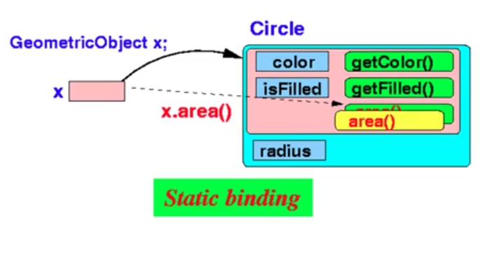
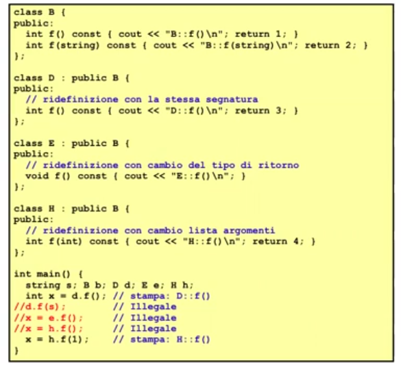
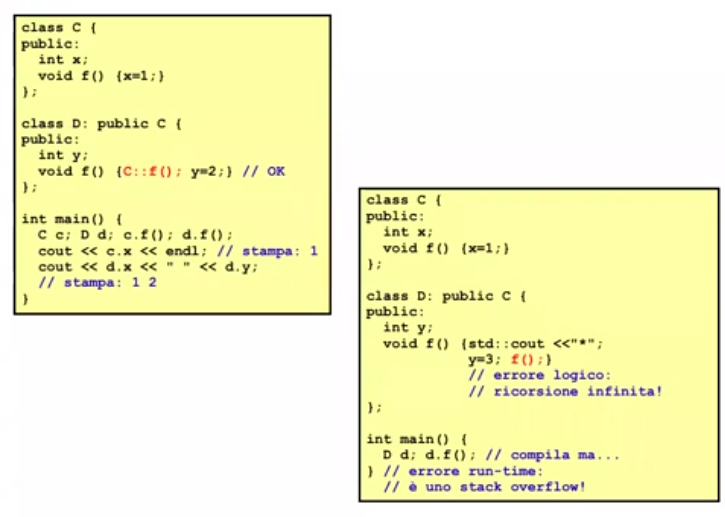
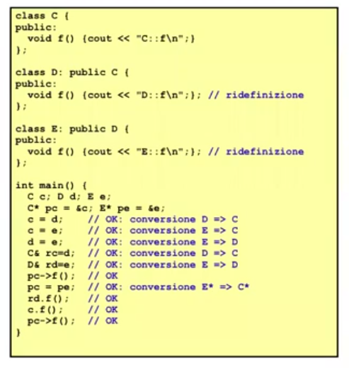

# Descrizione

Ridefinizione di metodi per classi derivate


## Ridefinizione di metodi

Potrebbe avere senso ridefinire nella classe derivata alcune funzionalitá ereditate dalla classe base

I metodi sono concepiti come dei contratti, quindi l'implementazione di un contratto della base 
potrebbe richiedere adattamenti o variazioni nella classe derivata

Ci sono 2 modalitá di ridefinire un metodo:

1. Stessa segnatura

2. Stesso nome di metodo ma segnatura diversa

```cpp
dataora dataora::operator+(const orario& o) const{
    dataora aux = *this;
    /*  
        ATTENZIONE: 
        aux.sec = sec + .sec; Darebbe un errore di compilazione!
        Perché anche se sec é dichiarato protected in orario o.sec é comunque inaccessibile in dataora
    */
   aux.sec = sec + 3600*o.Ore() + 60*o.Minuti() + o.Secondi();
    if(aux.sec >= 84600){
        aux.sec = aux.sec - 86400;
        aux.AvanzaUnGiorno();
    }
    return aux;
}

void dataora::AvanzaUnGiorno(){ // metodo proprio
    if(giorno < GiorniDelMese())
        giorno++;
    else if(mese < 12){
        giorno = 1; 
        mese++;
    }
    else{
        giorno = 1;
        mese = 1;
        anno++;
    }
}

int main(){
    orario o1, o2;
    dataora d1, d2;
    o1 + o2;    // invoca orario::operator+
    d1 + d2;    // invoca dataora::operator+
    o1 + d2;    // invoca orario::operator+
    d1 + o2;    // invoca dataora::operator+
    orario y = d1 + d2;     // OK 
    dataira x = o1 + o2;    // ILLEGALE!
    d1.orario::operator+(d2);   // invoca orario::operator+, SERVE OPERATORE DI SCOPING::
}
```

## Name hiding rule

Una ridefinizione in D del nome di metodo m() nasconde sempre tutte le versioni sovraccaricate di m() disponibili in B, che non sonoquindi direttamente accessibili in D ma solamente tramite l'operatore di scoping B::

Ció vale anche se la segnatura non é uguale

Se ridefiniamo il metodo Ore() in dataora con segnatura:

```cpp 
int dataora::Ore(int) const{
    ...
}
```
Non possiamo piú scrivere:

```cpp
dataora d;
cout << d.Ore(); // ILLEGALE
```
Perché il "vecchio" metodo Ore() nella classe orario é maschertato in dataora dalla ridefinizione.  
Per l'accesso possiamo peró usare l'operatore di scoping:: 

```cpp
dataora d; 
cout << d.orario::Ore();
```

## Static binding nell'invocazione di metodi



```cpp
class Base{
    private: 
        int x;
    public:
        void f() {x = 2};
};

class Derivata: public Base{
    private:
        int y;
    public:
        void f() {  // ridefinizione
                    // qui viene prima chiamata f() originale e poi fatto quanto necessario dalla derivata 
            Base::f(); 
            y = 3;
        }
};

int main(){
    Base b;
    Derivata d;
    Base* p = &b;
    p->f(); // invoca ovviamente Base::f()
    p = &d; // ora p* punta alla derivata quindi Derivata*
    p->f(); // MALE: invoca comunque Base::f(), non é quello che vogliamo
}
```

## Esempi di ridefinizione



Illegalitá:
1. d.f(s) : non c'é d.f(string) in D, bisogna usare l'operatore di scoping::
2. x = e.f() : la f() nella E é void ma l'asegnazione richiede un int
3. x = h.f() : non c'é h.f() senza parametri in H, bisogna usare l'operatore di scoping::



