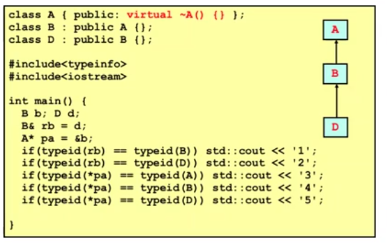
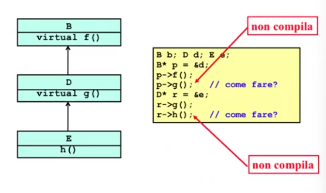
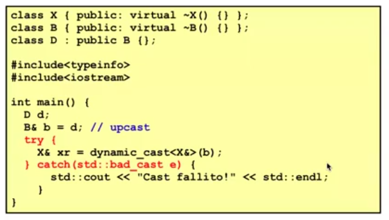
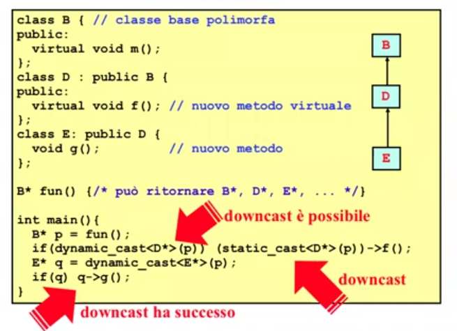
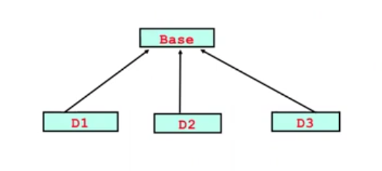
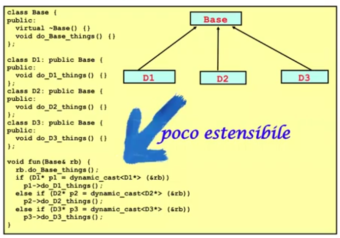
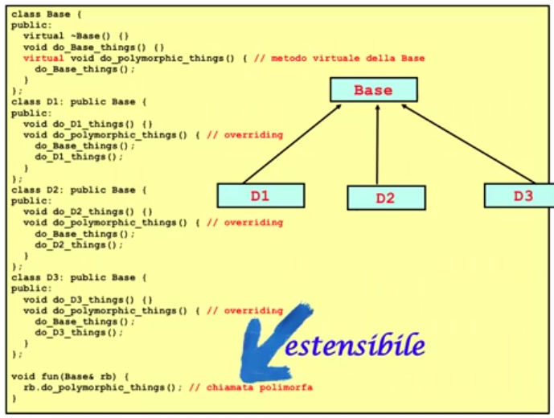

# Descrizione

Discussione riguardo RTTI (Run-Time Type Information) in C++


## RTTI

Sono gli strumenti forniti dal linguaggio per fare type introspection cioé per ragionare sui tipi a runtime di un certo linguaggio di programmazione  
Sono strumenti per capire il tipo dinamico a runtime di una variabile polimorfa, l'interesse in C++ é per:

1. TD(ptr) tipo dinamico di puntatore polimorfo ptr

2. TD(ref) tipo dinamico di riferimento polimorfo ref

### Operatore typeid

L'operatore typeid permette di determinare il tipo di una espressione qualsiasi a tempo di esecuzione  
Se l'espressione é un riferimento polimorfo o un puntatore polimorfo dereferenziato allora typeid ritorna il tipo dinamico  

Ha un argomento: una espressione qualsiasi, anche un tipo stesso    
Ritorna un oggetto blindato di tipo type_info
Si puó usare sopratutto per confronti

```cpp
#include <typeinfo> // includere sempre questo header file
#include <iostream> // per usare typeid

int main(){
    int i = 5;
    std::cout << typeid(i).name() << std::endl;     // stampa: i(nt)
    std::cout << typeid(3.14).name() << std::endl;  // stampa: d(ouble)
    if(typeid(i) == typeid(int))
        std::cout << "Yes";
}
```

Comportamento di typeid

1. Se l'espressione operando di typeid é un riferimento ref ad una classe che contiene almeno un metodo virtuale, cioé una classe polimorfa, allora typeid restituisce un oggetto di type_info che rappresenta il tipo dinamico di ref

2. Se l'espressione operando di typeid é un puntatore dereferenziato *punt, dove punt é un puntatore ad un tipo polimorfo, allora typeid restituisce un oggetto type_info che rappresnta il tipo T dove T * é il tipo dinamico di punt

ATTENZIONE

1. Se la classe non contiene metodi virtuali allora typeid restituisce il tipo statico del riferimento o del puntatore dereferenziato

2. typeid su un puntatore (non dereferenziato) restituisce sempre il tipo stati di un puntatore




## Upcasting e Downcasting



Downcasting (chiamato anche raffinamento di tipo) é l'atto di convertire un riferimento da una classe Base (che sta su) a un suo sottotipo (che sta giú)


### Operatore dynamic_cast

Abbiamo una Base B tipo polimorfo, un sottotipo D (D <= B, non per forza sottotipo diretto/proprio) e un puntatore B* p (puntatore polimorfo)

Quello che voglio fare é  
Downcast: B* => D* , B& => D&

Quando converto B* a D* il tipo dinamico mi grantisce che ho almeno un D

```cpp
dynamic_cast<*D>(p)
```

Il tipo a cui voglio convertire il puntatore polimorfo prende il nome di tipo target e si trova all'interno di < >  
Sará un sottotipo del tipo di dichiarazione del puntatore che sto cercando di convertire  
L'argomento é un puntatore a B dove B é un supertipo di D e si trova all'interno di ( )
Ritorna un puntatore del tipo target (in questo caso D*)

Una conversione dinamica di un puntatore verso un tipo target ha successo, cioé ritorna un puntatore diverso da null, se e solo se il tipo dinamico del puntatore oggetto della conversione é compatibile con il tipo target

TD(p) <= D*  
Tipo dinamico di p compatibile con il tipo target D*


Nel caso dei riferimenti, se il dynamic_cast di un riferimento fallisce allora viene sollevata un'eccezione di tipo std::bad_cast (definito nel file header typeinfo)



Nell'esempio a seguito, dopo aver controllato che p é almeno un D* tramite il dynamic cast viene fatto un downcast tramite static_cast in quanto piú efficiente rispetto al dynamic_cast

Notiamo anche all'ultima riga che un'altro tipo di controllo che si puó fare é direttamente su q: nell'istruzione precedente abbiamo provato a fare il dynamic_cast di p verso E* ed assegnarlo ad un E* q;  
se ció avrá avuto successo su q troveremo l'indirizzo di p, altrimenti un nullptr: nell'if successivo, se il cast avrá avuto successo sará possibile eseguire q->g(), altrimenti no




## Downcasting vs Metodi Virtuali

1. Usare il downcasting solo quando necessario

2. non fare typechecking dinamico inutile

3. ove possibile usare metodi virtuali nelle classibase piuttosto che fare typechecking dinamico


### Design pattern



Nella versione seguente (typechecking dinamico), ottenuta usando il dynamic_cast il codice risulta poco estensibile: se viene creato un sottotipo D4, il codice non funzionerá per tale sottotipo



L'alternativa é definire nella base un metodo virtuale (eventualmente astratto, se é richiesto) che fa cose polimorfe: fa le task a seconda della propria ridefinizione (dove é stato overrided)



Come possiamo notare questa soluzione é estremamente piú estensibile, ad esempio e il tipo D4 necessita di qualche funzionalitá della base rivisitata puó essere overrided e risolvere le sue task
