# Descrizione

Discussione riguardo l'ereditarietá multipla


## Multiple Inheritance

É stata una quesitone controversa per molti anni a cusa della sua complessitá e abmiguitá in casi di, ad esempio, "diamond problem":  
quando avendo piú basi da cui ereditare, potrebbe succedere che queste piú basi hanno una base comune. eredito da A, eredito da B
e antenato C: sotto sotto c'é un C dentro A ed un C dentro B, e quindi ho una doppia copia di questo antenato comune.  

Quella che vedremo noi prenderá il nome di ereditarietá virtuale

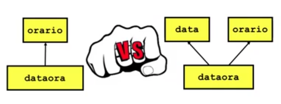

In questo caso, dataora si occupa di risolvere i problemi di data al suo interno; per i principi SOLID é bene invece che data sia risolto con un tipo data: in modo natuarle quindi eredito da data e da ora per ottenere dataora

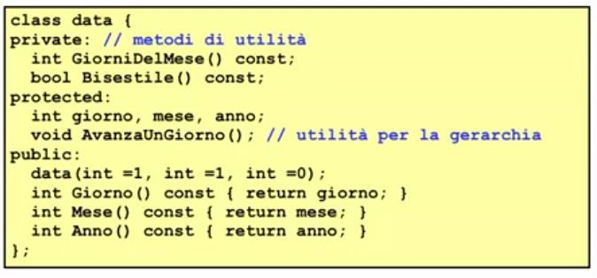

Gli oggetti, in caso di ereditarietá multipla sono rappresentati come segue:

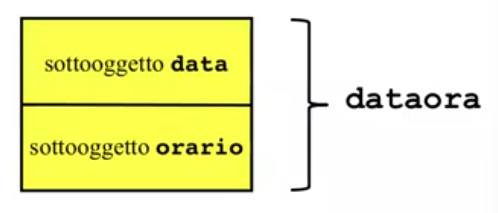

La lista di derivazione é cosi definita:

```cpp
#include "orario.h"
#include "data.h"

class dataora: public data, public orario{
    public:
        dataora() {}
        datora(int a, int me, int g, int o, int m, int s): data(a,me,g), orario(o,m,s){}
};
```
La modalitá di derivazione é singola per ogni base (quasi sempre tutti public)  
Il costruttore di dataora (la classe derivata con ereditarietá multipla):
1. con ereditarietá singola dovrá costruire la sua base
2. con ereditarietá multipla dovrá costruire le sue basi: quindi nella lista di inizializzazione del costruttore dovró inserire delle chiamate ai costruttori della basi dirette per costruire i sottooggetti

N.B.: se non vengono esplicitate, ci sono le costruzioni di default (che quindi devono essere disponibili)

Supponiamo di avere sia nella classe orario che nella classe data un metodo Stampa(), la classe dataora eredita due metodi diversi con lo stesso nome e segnatura: se non ne faccio una ridefinione in dataora e tento di invocare quella funzione con dataora il compilatore non segnala alcuna illegalitá a compile time.  
Il problema sorge se viene invocata Stampa() senza essere stata ridefinita in dataora: per risolvere questa ambiguitá si deve usare l'operatore di scoping::  

N.B.: l'ambiguitá rimane anche se le funzioni omonime hanno diverso numero di parametri, il problema sta proprio nello stesso nome della funzione

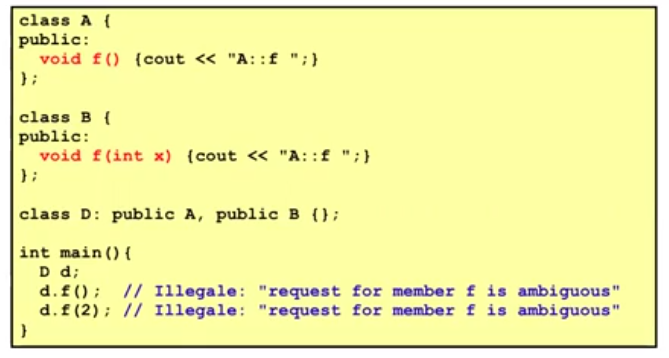

In sintesi, se vengono ereditate piú funzioni con lo stesso nome il programmatore dove occuparsi nella derivata di disambiguare 

La risoluzione definitiva é ridefinire il metodo nella derivata:

```cpp
void dataora::Stampa() const{
    data::Stampa();
    cout << ' ';
    orario::Stampa();
}
```

## Problema del diamante

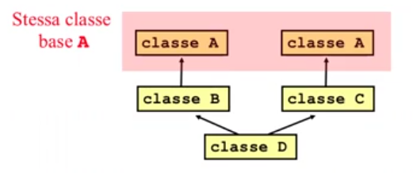

Nel seguente esempio notiamo 2 problemi, due sottooggetti della classe base comune A:
1. Ambiguitá: D é sottotipo di B che é sottotipo di A, ció significa che D é anche un A. Peró per vedere un D come un A puó passare per i 2 rami di ereditarietá (attraverso B o attraverso C)
2. Spreco di memoria: doppia copia di A in D se assumiamo che le 2 copia di A siano identiche

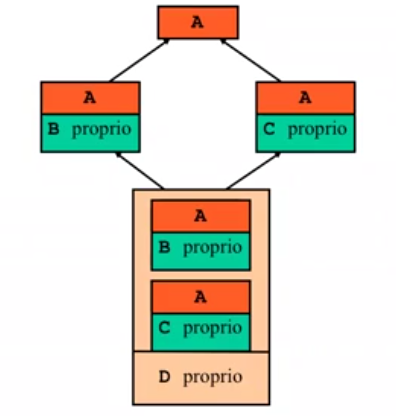

Concretamente il problema si dimostra in questo modo:

```cpp
class A{
    public:
        int a;
        A(int x =1): a(x){}
};

class B: public A{
    public:
        B(): A(2){}
};

class C: public A{
    public:
        C(): A(3){}
};

class D: public B, public C{ };

int main(){
    D d;
    A* p = &d;      // Illegale: A é una classe base ambigua per D
    cout << p->a;   // Quale sottooggetto di A si dovrebbe usare?
}
```

## Soluzione: Ereditarietá virtuale

Un unico sottooggetto di tipo A in ogni oggetto della classe D che chiude il diamante

Virtuale significa che quando derivo da una base devo decidere a momento di progettazione se quella base puó diventare una base comune in una situazione di ereditarietá multipla e quindi questo passo di derivazione va marcato come virtuale

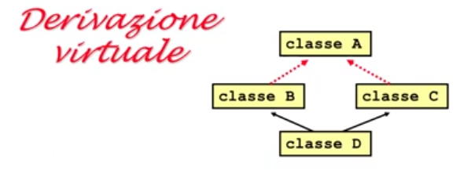

```cpp
class A{    // A é una classe base virtuale
    ...
};

class B: virtual public A{
    ...
};

class C: virtual public A{
    ...
};

class D: public B, public C{
    ...
};
```
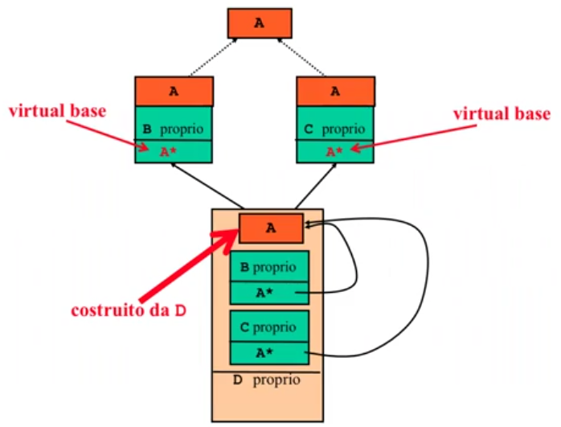

Viene aggiunto un puntatore alla base virtuale, quando chiudo il diamante la parte A della base virtuale comune non ha piú A, ma hanno il puntatore ad A (esiste in copia unica) lo deve costruire D e si fanno puntare questi puntatori a questo sottooggetto della base virtuale comune 


## Unique final overrider rule

Le funzioni virtuali ereditate dalle basi (in caso di ereditarietá multipla) chiama che questi override abbiano un overriding finale nella classe che eredita sia da B che da C  
In caso contrario ho una illegalitá del compilatore, fondamentalmente essendo una classe polimorfa il compilatore ha bisogno di sapere dove far puntare l'indirizzo della funzione virtuale (se ne ha 2 non sa quale scegliere)

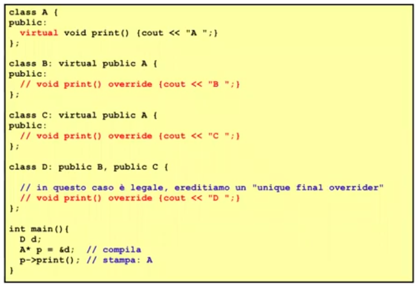


## Costruttori di D in presenza di basi virtuali

1. Per primi vengono richiamati, una sola volta, i costrutotri delle classi base virtuali che si trovano nella gerarchia di derivazione di D. VI puó essere piú di una classe base virtuale nella gerarchia di derivazione di D: la ricerca delle classi base virtuali nella gerarchi procedendo seguendo l'ordine da sinistra verso destra e dall'alto verso il basso ("left-to-right top-down order");

2. Una volta che sono stati invocati i costruttori delle classi virtuali nella gerarchia di derivazione D, vengono richiamati i costruttori delle superclassi dirette non virtuali di D: questi costruttori escludono di richiamare eventuali costruttori di classi virtuali giá richiamati al passo (1.); 

3. Infine viene eseguito il costruttore proprio di D, ovvvero vengono costruiti i campi dati propri di D e quindi viene eseguito il corpo del costruttore di D

Le chiamate dei costruttori dei punti (1.) e (2.), se non sono esplicite, vengono automaticamente inserite dal compilatore nella lista di inizializzazione del costruttore di D: in questo caso, come al solito, si tratta di chiamate implicite ai costruttori di default.

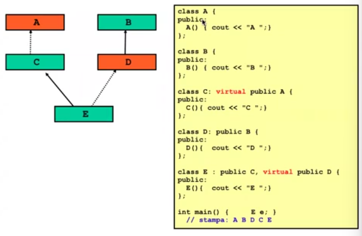

Per prima cosa vengono istanziate le classi di basi virtuali, A e D: left-to-right quindi prima A e poi D  
Per costruire D dobbiamo prima costruire il sottooggeto B di D quindi dobbiamo prima prima costruire B  
A questo punto ho costruito: A B D  
Rimane, per costruire l'E di guardare quali sono i suoi genitori diretti (C e D)  
Costruisco il C, che vorrebbe costruire un A ma siccome é giá stato costruito non viene stampato A C ma solo C: se A non fosse virtuale avrebbe costruito anche A  
Poi dovrei costruire D ma é giá stato costruito, quindi non viene costruito  
Infine viene costruito E, ottenendo infine in stampa:  
A B D C E

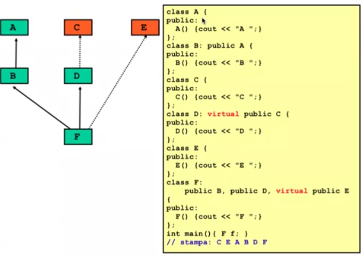


## Esercizio cilicono

Implementazione gerarchia seguente:

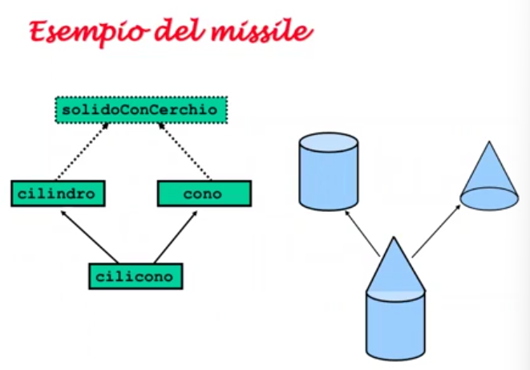

