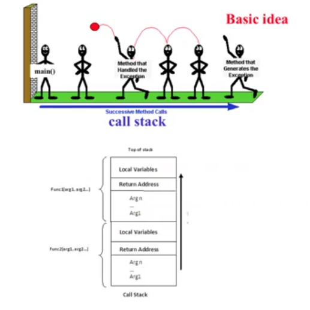
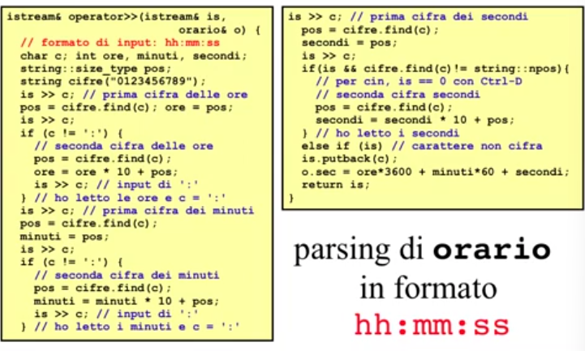
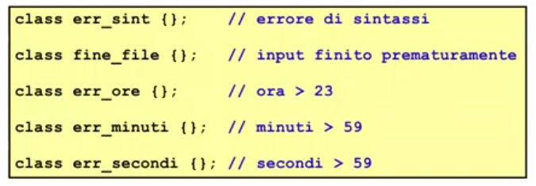
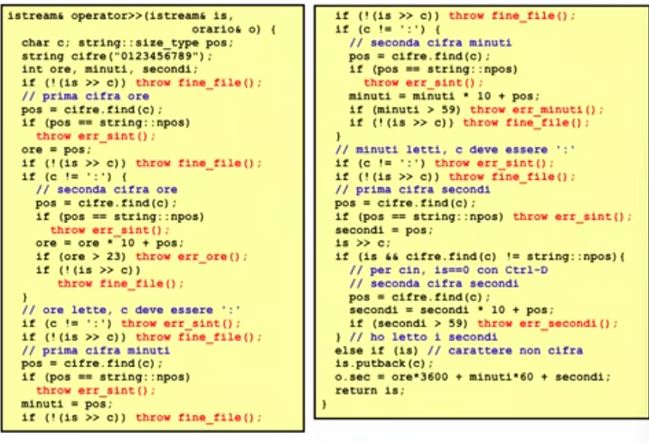
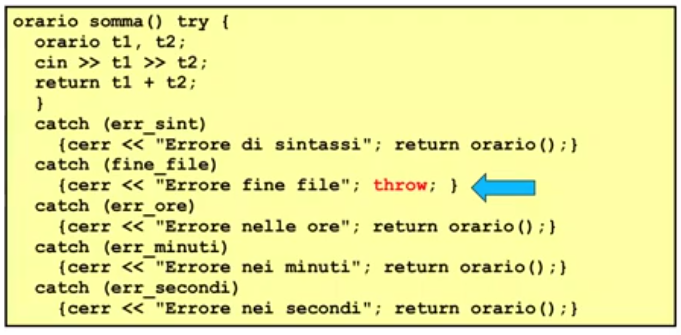
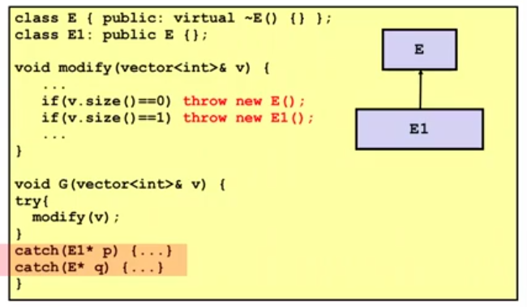
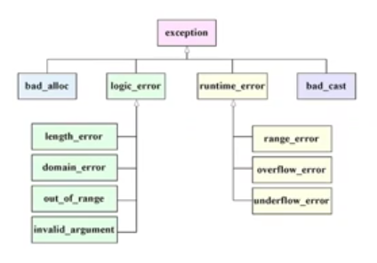

# Descrizione

Discussione riguardo le eccezioni in C++


## Gestione delle eccezioni


Le eccezioni sono situazioni anomale che devono essere gestite.  

La gestione delle eccezioni é il processo di rispondere all'occorenza a run-time a condizioni anomale che richiedono una elaborazione speciale.  
In generale é gestita salvando il corrente stato di esecuzione in un posto predefinito e si "passi la palla" ad un exception handler (gestore delle eccezioni) che é una subroutine (funzione).

Sono modellate con dei Tipi.



Il punto piú adatto per gestire l'eccezione non é detto che sia nel chiamante della funzione che ha generato l'eccezione; l'eccezione viene quindi rimpallata fino al bottom dello stack dove si trova il main() che é l'ultima speranza di risolvere l'eccezione.  
Se anche li non viene risolto viene richiamata una funzione abort() che termina in modo anormale il programma.

La funzione in cui verificala situazione eccezionale solleva (o lancia) una eccezione tramite una throw:

```cpp
telefonata bolletta::Estrai_Una(){
    if(Vuota()) throw Ecc_Vuota();
    telefonata aux = first->info;
    first = first->next;
    return aux;
}

class Ecc_Vuota{ };
```

Estrai_Una() segnala al chiamante che la bolletta era vuota tramite la throw, il controllo passa quindi al chiamante, esco dalla funzione: il chiamante deve decidere come gestire l'eccezione.

Gestire una funzione che puó sollevare una funzione, quella funzione deve essere messa dentro un blocco try: ha senso solo se il codice che sta dentro il blocco try puó sollevare un'eccezione.  
Se l'eccezione si verifica avró il blocco catch, con tipo dell'eccezione e passaggio per valore (e) copia dell'oggetto che é stato sollevato.
All'interno del blocco catch ci dovrá essere il codice di gestione della situazione eccezionale: in questo caso restituiamo tramite il canale cerr l'errore

```cpp
int main(){
    ...
    try{
        b.Estrai_Una();
    }
    catch (Ecc_Vuota e){
        cerr << "La bolletta é vuota" << endl;
        abort();    // definita in stdlib.h
                    // terminazione anormale di programma
    }
    ...
}
```

Un tipico esempio che genera situazioni eccezionali é il parsing:  
Ad esempio, abbiamo visto in orario di voler ricevere un orario in formato hh:mm:ss



Si possono verificare varie situazioni di errore in questa funzione. Il parser non é "robusto".

Definiamo ad esempio le seguenti classi di eccezioni:



Ed ecco come potrebe essere un parsing robusto di orario in formato hh:mm:ss



Nel file Chiamante_Eccezione.cpp si trova una buona implementazione di exception handler nella funzione chiamante

Una throw puó sollevare una espressione di qualsiasi tipo

```cpp
// enum di ecccezioni invece che classi distinte
enum Errori{ErrSintassi, ErrFineFile, ErrOre, ErrMinuti, ErrSecondi};
...

    if (secondi > 59) throw ErrSecondi;
    // invece di
    // if (secondi > 59) throw err_secondi()
```

## Flusso del controllo provocato da una throw

Quando in una funzione F viene sollevata una eccezione di tipo T tramite una istruzione throw iniziala ricerca della clausola catch in grado di catturarla

1. Se l'esempressione throw é collocata in un blocco try nel corpo della stessa funzione F, l'esecuzione abbandona il blocco try e vengono esaminate in successione tutte le catch associate a tale blocco: POCO SENSATO!

2. Se si trova un type match per una catch l'eccezione viene catturata e viene eseguito il codice della catch; eventualmente, al termine dell'esecuzione del corpo della catch il controllo dell'esecuzione passa al punto di programma che segue l'ultimo blocco catch.

3. Se non si trova un type match per una catch oppure se l'istruzione throw non era collocata all'interno del blocco try della stessa funzione F la ricerca continua nella funzione che ha invocato la funzione F: CASO PIÚ COMUNE!

4. Questa  ricerca top-down sullo stack delle chiamate di funzioni continua fino a che si trova una catch che cattura l'eccezione o si arriva alla funzione main nel qual caso viene richiamata la funzione di libreria terminate() che per default chiama la funzione abort() che fa terminare il programma in errore.

### Rilanciare un'eccezione 

É possibile che una clausola catch si accorga di non poter gestire direttamente un'eccezione. In tal caso essa puó rilanciare l'eccezione alla funzione chiamante con una throw.




## Utilizzo di risorse

```cpp
gestore() {
    risorsa rs; // alloco la risorsa
    rs.use();
    ...
    ... // codice che puó sollevare eccezioni
    ...
    rs.release();   // non viene eseuita in caso di eccezione
}
```

Se viene sollevata una eccezione e questa non viene catturata all'interno della funzione si esce dalla funzione senza rilasciare la risorsa. Ad esempio, la risorsa é la memoria e quindi si potrebbe provocare garbage.

### Clausola catch generica

```cpp
gestore() try{
    risorsa rs; 
    rs.use();
    ... // codice che puó sollevare eccezioni
    rs.release();   // non viene eseuita in caso di eccezione
}
catch(...){ // catch generica protettiva
    rs.release();
    throw;  // rilancio l'eccezione al chiamante
}
```

In un esempio reale abbiamo 

```cpp
void F() try{
    A* p = new A[3]; 
    ...
    if(condition) throw p
    ...
    delete[] p;
}
catch(...){ 
    delete[] p
}
```

## Match del tipo delle eccezioni 

La catch che cattura un'eccezione di tipo E é la prima catch incontrata durante la ricerca che abbia un tipo T compatibile con E.  
Le regole che definiscono la compatibilitá tra il tipo T del parametro di una catch non generica ed il tipo E dell'eccezione sono le seguenti:

1. Il tipo T é uguale al tipo E;

2. Il tipo E é un sottotipo di T, ovvero:
    1. E é un sottotipo derivato pubblicamente da T;  
    2. T é un tipo puntatore B* ed E é un tipo puntatore D* dove D é un sottotipo di B;  
    3. T é un riferimento B& ed E é un tipo riferimento D& dove D é un sottotipo di B;  

3. T é il tipo void* ed E é un qualsiasi tipo puntatore

4. NON POSSONO ESSERE APPLICATE CONVERSIONI IMPLICITE

Per subtyping dobbiamo invocare prima le eccezioni piú definite (derivate nella gerarchia) e poi quelle meno definite, altrimenti nell'esempio, E "prende" anche le eccezioni di E1 e quindi alcuni gestori sarebbero codice morto




## Comportamenti tipici di una clausola catch

I comportamenti tipici di una clausola catch sono i seguenti:
 
1. Rilanciare un'eccezione

2. Convertire un tipo di eccezione in un altro, rimediando parzialmente e lanciando un'eccezione diversa

3. Cercare di ripristinare il funzionamento, in modo che il programmapossa continuare dall'istruzione che segue l'ultima catch

4. Analizzare la situazione che ha causato l'errore, eliminarne eventualmente la causa e riprovare a chiamare la funzione che ha causato originariamente l'eccezione

5. Esaminare l'errore ed invocare std::terminate()


## La gerarchia exception

Il C++ standard prevede una gerarchia di classi di eccezioni predefinita



exception é la classe base, da cui derivano runtime_error e logic_error, da cui derivano parecchie classi

Derivano da exception anche le seguenti classi di eccezioni:

1. bad_cast, le cui eccezioni sono lanciate dal dynamic_cast per riferimenti

2. bad_alloc, lanciata dalla new quando lo heap é esaurito (il gestore di default invoca la terminate())

3. bad_typeid, viene lanciata dall'operatore typeid quando ha come argomento un puntatore nullo