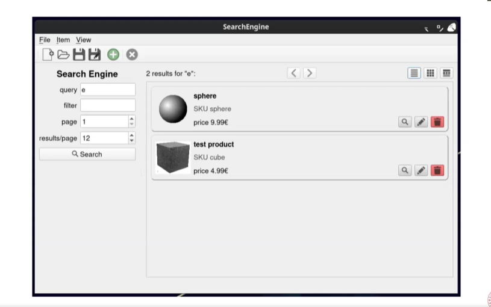
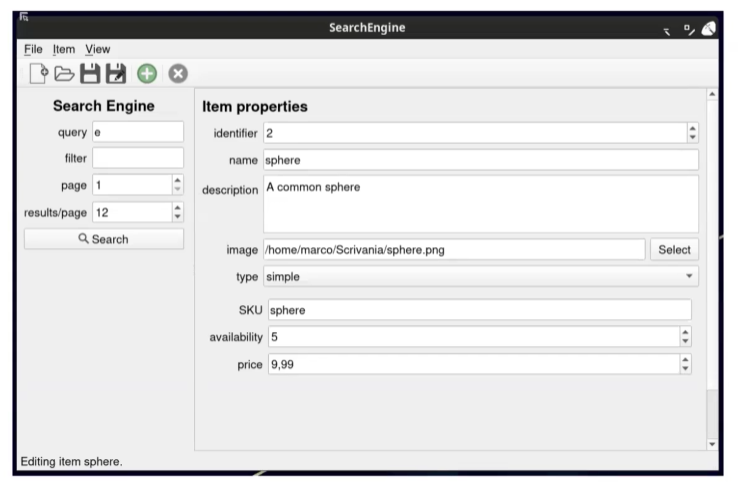

# **Descrizione**

Workshop di progetto comprensivo di 5 fasi.

## **RECAP**

Le 5 fasi del workshop comprendono:
1.  Idea
2.  Sketch
3.  Core Model Code
4.  GUI Code
5.  Refinement e Report

Tutte le componenti del Workshop sono presenti nella subfolder [Workshop](Workshop)

## **Idea**

La fase dell'idea riguarda 4 punti principali:
1.  Trovare un soggetto
2.  Ispirarsi ad un software simile
3.  Scrivere un brief riassuntivo
4.  Descrivere una lista di funzionalità

Nell'idea si impongono limiti, vincoli (nel caso del progetto si trovano le specifiche);
Nella fase Idea è semplice cancellare idee non solide, al contrario della fase implementativa in cui diventa costoso cancellare classi inutilizzate.

In questo workshop creeremo un "Search Engine" per un "eCommerce Website";

Prenderemo spunto da alcuni degli eCommerce piu' famosi che implementano un search engine;

Una breve descrizione di 100-200 parole che funzioni da linea guida durante il life-cycle del progetto;

Descrizione a livello pianificativo delle funzionalità che il nostro progetto dovrà includere sicuramente;

Nel nostro esempio [Idea](Workshop/Idea.md) partiremo da questa idea

## **Sketch**

Nella fase di Sketch vengono svolti i seguenti 4 punti:
1.  Disegnare una rappresentazione dell'applicazione
2.  Enfatizzare la struttura e le componenti principali
3.  Mostrare le funzionalità
4.  Scegliere a discrezione se disegnarla tramite arte concettuale o tramite un'immagine realistica

## **Core Model Code**

In questa fase ci concentriamo sul cuore del modello logico:
1.  Pianificare le classi, attributi e funzioni (UML?)
2.  Scriverne il codice
3.  Eseguire test formali
4.  Ripetere se necessario

Nel nostro esempio [CoreModel](Workshop/CoreModelCode.md) avremo questa struttura, in cui notiamo 2 versioni del visitor: un constVisitor ed un Visitor (per invocazioni in metodi costanti)

## **GUI Code**

In questa fase svilupperemo la parte grafica seguendo gli stessi principi del core model:
1.  Pianificare le classi, attributi e funzioni (usando possibilmente UML anche qui)
2.  Scriverne il codice
3.  Eseguire test informali
4.  Ripetere se necessario

## **Refinement e Report**

In questa fase si tratteranno le parti di rifinitura del progetto, come la ricerca di asset di qualità, o perfezionamento di algoritmi sketchati nelle fasi precedenti, scorciatoie da tastiera ecc...
In particolare:
1.  Rifinire la GUI
2.  Scegliere gli asset finali
3.  Prepare un dataset completo 
4.  Scrivere un report convincete

### *Refinement GUI*

Nello specifico, per il rifinimento della GUI:
1.  Tool-tips per i pulsanti
2.  Icone
3.  Scorciatoie da tastiera
4.  Colori e stile (UI design), è possibile usare fogli di stile (qss) come css per applicare gli stili ad elementi, classi ed ID

### *Refinement Assets*

Per la versione finale degli asset è bene tenere a mente:
1.  Usare un aspect ratio e una risoluzione adeguati
2.  Ottimizzare il loro peso (in KB)
3.  Utilizzare colori in linea con lo stile generale della GUI
4.  Le stesse proprietà valgono anche per gli asset multimediali

### *Stesura del report*

Un buon report dovrebbe:
1.  Far capire facilmente al lettore il soggetto
2.  Mantenere separati i contenuti personali da quelli tecnici
3.  Usare immagini quando necessario (UML, grafici ecc..)
4.  Specificare i contributi 

