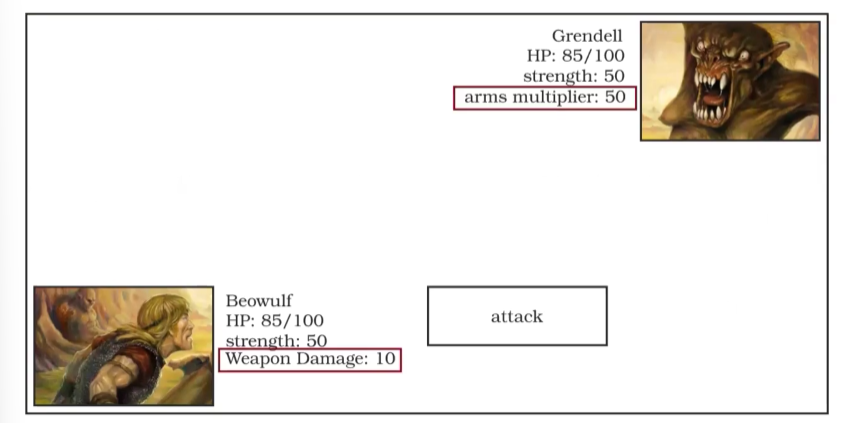

# **Descrizione**

Workshop di progetto comprensivo di 5 fasi.

## **RECAP**

Le 5 fasi del workshop comprendono:
1.  Idea
2.  Sketch
3.  Core Model Code
4.  GUI Code
5.  Refinement e Report

Tutte le componenti del Workshop sono presenti nella subfolder [Workshop](Workshop)

### *Visitor*

## **Esempio di polimorfismo**

## **Visitor e approcci errati**

### *Approcci errati o non ottimali*

## **Visitor**

### *Esempio di visitor concreto per widget adatto al tipo*

