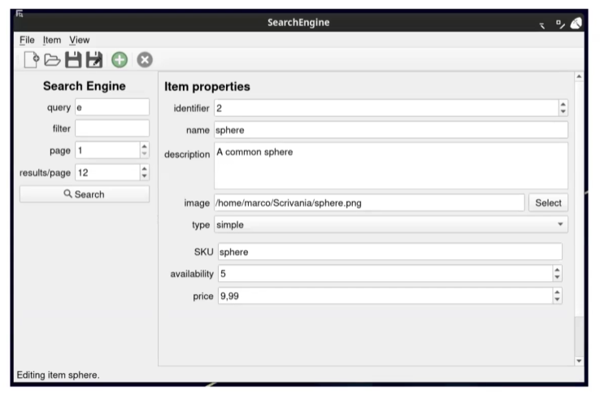

# **Descrizione**

Workshop di progetto comprensivo di 5 fasi.

## **RECAP**

Le 5 fasi del workshop comprendono:
1.  Idea
2.  Sketch
3.  Core Model Code
4.  GUI Code
5.  Refinement e Report

Tutte le componenti del Workshop sono presenti nella subfolder [Workshop](Workshop)

## **Idea**

La fase dell'idea riguarda 4 punti principali:
1.  Trovare un soggetto
2.  Ispirarsi ad un software simile
3.  Scrivere un brief riassuntivo
4.  Descrivere una lista di funzionalità

Nell'idea si impongono limiti, vincoli (nel caso del progetto si trovano le specifiche);
Nella fase Idea è semplice cancellare idee non solide, al contrario della fase implementativa in cui diventa costoso cancellare classi inutilizzate.

In questo workshop creeremo un "Search Engine" per un "eCommerce Website";

Prenderemo spunto da alcuni degli eCommerce piu' famosi che implementano un search engine;

Una breve descrizione di 100-200 parole che funzioni da linea guida durante il life-cycle del progetto;

Descrizione a livello pianificativo delle funzionalità che il nostro progetto dovrà includere sicuramente;

Nel nostro esempio [Idea](Workshop/Idea.md) partiremo da questa idea

## **Sketch**

Nella fase di Sketch vengono svolti i seguenti 4 punti:
1.  Disegnare una rappresentazione dell'applicazione
2.  Enfatizzare la struttura e le componenti principali
3.  Mostrare le funzionalità
4.  Scegliere a discrezione se disegnarla tramite arte concettuale o tramite un'immagine realistica

## **Core Model Code**

In questa fase ci concentriamo sul cuore del modello logico:
1.  Pianificare le classi, attributi e funzioni (UML?)
2.  Scriverne il codice
3.  Eseguire test
4.  Ripetere se necessario

Nel nostro esempio [CoreModel](Workshop/CoreModelCode.md) avremo questa struttura

