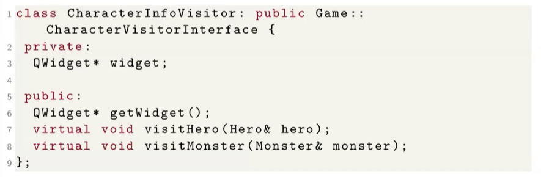

# **Descrizione**

Discussione riguardo il polimorfismo in Qt ed all'uso dei Visitor.

## **RECAP**

### *Visitor*

1.  Separa la struttura dati dalla rappresentazione visiva
2.  Estende dinamicamente le funzionalità della classe
3.  Error-checking assistito dal compilatore (quando aggiungiamo un nuovo tipo concreto il compilatore ci segnala tutte le implementazioni mancanti per gestire questo nuovo tipo di dato)
4.  Design pattern consolidato
Al costo di un po' piu' di codice

## **Esempio di polimorfismo**

Prendiamo come esempio il gioco di carte "Magic: The Gathering" in cui notiamo che la struttura della carta è pressochè la stessa ma differiscono in base al loro tipo: ad esempio le terre hanno un proprio colore e non hanno attributi ne costo, le creature al contrario hanno un costo e delle abilità, mentre gli artefatti hanno sempre un costo ma hanno un effetto.

Come rappresentiamo quindi queste 3 tipologie di dato concreto differenti se dovessimo implementare un gioco come "Magic: The Gathering"?

In questa rappresentazione vediamo che la carta ha una member funtion che restituisce il nome, mentre i vari sottotipi di carta hanno member functions differenti tra loro (getColor(), getAbilities(),...);

## **Visitor e approcci errati**

Nel nostro running example l'infoPanel dell'eroe e del mostro avevamo previsto avere un attriuto specifico per loro esclusivo, l'eroe ha come attributo aggiuntivo il danno dell'arma ed il mostro ha un moltiplicatore dato dal numero di arti;

### *Approcci errati o non ottimali*

I seguenti approcci potrebbero funzionare per proggetti di piccolissime dimensioni ma sono molto inclini a fallire in progetti piu' grandi:

1.  Funzione std::string Character::getContent()
2.  Funzione QWidget* Character::render() 
3.  RTTI / Dynamic Cast / typeid
4.  Funzione std::string Character::getType()

Motivazioni:
1.  Dotando la classe Character di una member function virtuale pura che restituisce la stringa da mostrare, restituendo nel caso dell'eroe "Weapon Damage " + la conversione in stringa del danno dell'arma e nel caso del mostro la stringa "Arms Multiplier" e restituendo il moltiplicatore per il numero di braccia;
Si riesce a fare ma sarà facilmente passibile di errori.
2.  Doto la classe Character di una member function render() che a seconda del fatto che sia un eroe o un mostro costruisce il widget adatto a come deve essere: il problema è che crea un raddoppio di widget ed accoppiamento eccessivo di modello logico e GUI violando la separazione tra GUI e modello logico;
(Problema anche con traduzioni)
3.  E' già piu' accettabile in quanto implementato direttamente per la parte grafica, ad esempio possiamo controllare nell'infoPanel se quello che viene passato è un eroe o un mostro tramite dynamic_cast e quindi mostrare esattamente cio' che serve.
Ha anch'esso dei problemi: dovendo aggiungere classi in ottica futura, si ha a che fare con if ed else per controllare il tipo dinamico che pero' cambia quando introduciamo una nuova classe. Inotlre risulta problematico anche l'ordinamento dei controlli e sopratutto in casi di ereditarietà multipla;
4.  Infine l'ultima versione con getType() non da nulla in piu' rispetto al dynamic_cast, ma utilizzandolo aggiungiamo anche member functions inutili al fine del funzionamento

## **Visitor**

Il metodo corretto è il design pattern Visitor (design pattern = metodologia generale di risoluzione che si applica in contesti che l'esperienza ha individuato essere ricorrenti, ad esempio i visitor appunto);

Il visitor consente di separare la struttura dei dati (classi del modello logico) dalla sua rappresentazione visuale in questo caso (o in generale dalle funzionalità aggiuntive di cui vogliamo dotare la nostra gerarchia).
Questo ci permette di estendere dinamicamente le funzionalità di una classe, perche la funzionalità aggiuntiva non necessiterà di modificare la struttura della classe ma viene fatto esternamente in una gerarchia di classi che si chiama visitor (in pratica stiamo separando la visualizzazione del tipo di dato dal tipo di dato stesso)

Al contrario di getType() e del dynamic_cast in cui il compilatore non ha idea di cosa stiamo facendo, con i visitor il compilatore sarà costretto a verificare che tutti i metodi virtuali siano implementati e di conseguenza se viene dimenticato qualcosa il compilatore lo segnalerà immediatamente;

Il visitor richiede pero' qualche riga di codice in piu' rispetto al dynamic_cast.

Nel diagramma già visto in precedenza non avevamo parlato della classe "CharacterVisitorInterface" e del metodo accept() in Character in quanto riguardanti proprio i Visitor;

I visitor concreti sono molteplici ed afferiscono tutti alla stessa interfaccia/classe astratta che ci dice come devono essere fatti tutti i visitor concreti, ci sarà ad esempio un visitor che disegna l'infoPanel del personaggio o un visitor distinto che utilizzando la stessa interfaccia salva un personaggio in formato JSON o un altro che lo espone in una API per interagire in un sistema REST.
Una volta definita una struttura per i visitor si tratta solo di realizzare i visitor concreti per implementare le funzionalità che ci interessano;

L'interfaccia del visitor espone una member function specifica per ciascuno dei tipi concreti che deve visitare, in pratica è a conoscenza di tutti i tipi di classe concreta di una gerarchia: in questo caso avendo Hero e Monster la classe del visitor avrà member functions visitHero() e visitMonster() e come parametro ricevono una istanza dell'oggetto concreto che devono visitare, lo possono ricevere tramite puntatore o riferimento e come tipo di ritorno é sempre void.

Oltre ai visitor in se, dobbiamo fare in modo che le classi del modello logico possano interagirci quindi nella classe astratta Character esponiamo una member function virtuale pura che per convenzione si chiama accept() che fa si che l'oggetto concreto accetti di essere visitato da un visitor (che deve ovviamente implementare l'interfaccia in questione) ed il tipo di ritorno è anche qui void;
Il parametro che riceve è un puntatore o un riferimento ad una istanza dell'interfaccia del visitor.

L'implementaizone corretta della member function accept() è one liner in cui il visitor che sta visitando la classe concreta vede invocato il proprio metodo visitCorretto(Hero o Monster) ed in entrambi i casi richiedono l'oggetto da visitare che è this (*this se passiamo ad accept() un riferimento o &this se passiamo ad accept() un puntatore);
Attraverso il metodo accept() stiamo andando a realizzare il polimorfismo, in quanto questro metodo virtuale accept() sceglie l'algoritmo di visita correta in base al tipo concreto del nostro Character.

### *Esempio di visitor concreto per widget adatto al tipo*

Ci servirà quindi una classe il cui compito sarà visitare un Character e costruire il widget opportuno.
Il visitor ritorna direttamente il widget costruito ma inseriamo un attributo privato QWidget* che costruirà il widget durante la visita ed al ritorno possiamo invocare una funzione ausiliaria come getWidget() per ritornare il widget costruito;

L'implementazione della classe è la seguente:
1.  Il metodo getWidget() ritorna semplicemente il widget costruito;
2.  Il metodo visitHero() inserisce nel puntatore QWidget* widget il puntatore che ci interessa quindi quando visitiamo un eroe vogliamo che il widget da mostrare sia una QLabel  che contiene la scritta "Weapon Damage" seguita dal valore numerico di questo danno ecc..
3.  Il metodo visitMonster() fa la stessa identica cosa cambiando il testo nella label ed accedendo ad un attributo diverso per il numero di arti;

Nella classe infoPanel invece dalla riga 8 alla riga 10 è riportata l'implementazione di questo visitor;
Dichiariamo una variabile CharacterInfoVisitor e sul Character (che non sappiamo di che tipo sia, puo' essere Mostro o Eroe a seconda dell'invocazione) invochiamo il metodo accept() passando il visitor concreto appena creato;
Infine viene aggiunto al layout il widget creato dal visitor tramite una invocazione di getWidget() sul visitor creato in precedenza che aggiungerà il widget corretto al layout.

### *Vantaggi e svantaggi*

Lo svantaggio notevole è il maggior codice da scrivere, ma piu' visitor vengono utilizzati piu' questo effetto diventa leggero;

## **Observer**

Il limite che vorremmo superare con gli observer sta nella member function playterAttacks(), che concettualmente dovrebbe fare solo 2 cose:
Eroe -> attacca -> Mostro
Mostro -> attacca -> Eroe;
Basterebbero evidentemente 2 righe di codice, ma attualmente ne abbiamo 4 perche ci stiamo portando la responsabilità di aggiornare la visualizzazione degli infoPanel relativa ai punti ferita;

L'observer risolve il problema di capire quando qualcosa ha avuto delle modifiche e rispondere di conseguenza (tipicamente aggiornando la visualizzazione in tempo reale senza aspettare che qualcuno chiami il metodo)

### *Il problema*

Possiamo descrivere il problema come:
1.  Info dovrebbe essere collegato al personaggio che sta rappresentando 
2.  Info dovrebbe aggiornarsi automaticamente quando cambia qualcosa nel proprio stato, senza intervento del programmatore
3.  L'approccio corrente inserisce in Battle la logica di aggiornamento della visualizzazione

### *La soluzione*

Cio' che cerchiamo di fare con l'observer è:
1.  Rimuovere la logica dell'aggiornamento della visualizzazione da Battle
2.  Collegare direttamente Info con il proprio Character
3.  Far in modo che Character notifichi il suo Info quando avviene un cambio di stato

Info sta quindi *osservando* Character

## **Pattern di un observer**

Ci servirà quindi una nuova interfaccia che chiameremo CharacterObserverInterface che esporrà un solo metodo notify() che riceve la notifica da parte di un Character (passato per riferimento o puntatore in base ai casi d'uso) quando questo effettua un cambiamento, il tipo di ritorno è sempre void;

Siccome sono i Character ad essere osservati dotiamo la classe Character di un attributo privato di un vettore di puntatori ad CharacterObserverInterface*, che si tratta di puntatori ad una classe astratta quindi ci sarà diversi osservatori concreti (essendo dati atratti tutto accadrà tramite polimorfismo).
Dotiamo anche la classe di un metodo non virtuale registerObserver() il cui parametro passato è un puntatore od un riferimento a CharacterObserverInterface o una classe concreta figlia di tale classe astratta;

La classe astratta CharacterObserverInterface ha un singolo metodo virtuale puro notify() che si aspetta un riferimento o puntatore ad un Character

La classe Character verrà dotata di un vettore di puntatori a CharacterObserverInterface, un vettore perche generalmente si usa piu' di un osservatore per valutare diversi cambiamenti

Il metodo non virtuale per aggiungere un ossevatore a questo personaggio ha è implementato alla riga 8 che fa un push_back dell'osservatore nel vettore degli oggetti osservati;

Nella parte superiore dell'immagine vediamo l'utilizzo degli observer quando essi vengono interpellati:
In takeDamage() siccome gli hitpoint potrebbero essere cambiati allora con un ciclo for accediamo a tutti gli osservatori nel nostro vettore di osservatori e per ciascuno di questi osservatori invochiamo la member funtion notify() passando come parametro *this, in questo modo l'osservatore riceverà una versione aggiornata dell'oggetto che è stato modificato e potrà intervenire.

Applicandolo al nostro running example la classe Info oltre ad essere un widget dovrà essere anche un Observer utilizzando l'ereditarietà multipla;
Per farlo dobbiamo ereditare sia da QWidget che da CharacterObserverInterface ed aggiungere la member function notify() alla quale passiamo un riferimento ad un Character;
La sua implementazione sarà la seguente:

A riga 11 vediamo che assomiglia molto a quella in show(), ma modifichiamo l'unico pezzo di interfaccia che potrebbe essere stato modificato: nell'etichetta che mostra i punti ferita inserendo "HP: " + la conversione da numero a QString dei punti ferita attuali (che magari potrebbero essere cambiati) ecc..

Cambia anche il costruttore perchè finchè non registriamo un osservatore non succede nulla, quindi quando costruiamo l'infoPanel invochiamo la member function registerObserver() sul personaggio da osservare passaando questo oggetto come ossevatore tramite this;
Cosi facendo quando l'infoPanel viene creato diventa immediatamente un osservatore del personaggio e da quel momento in poi che viene invocata takeDamage() su quel Character si aggiornerà tramite la notify().

Possiamo quindi rimuovere la member function refresh() da HeroPanel e MonsterPanel in quanto non piu' necessaria;

L'implementazione del metodo playerAttacks() diventerà piu' semplice.

