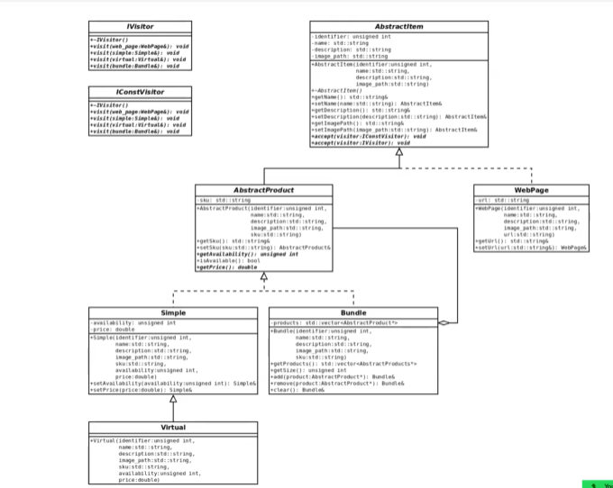

## **Pianificazione delle classi**

La freccia diversa da AbstractProduct a Bundle significa che ci possono essere piu' occorrenze (implementato tramite una lista o un vettore);
Tramite la classe astratta AbstractProduct mi garantisco che in un Bundle siano almeno tutti AbstractProduct, altrimenti non avrei potuto farlo, ed un Bundle avrebbe compreso anche una WebPage (illogico).

I vari oggetti, avendo attributi diversi (ad esempio una pagina web non ha una quantità come potrebbe averla un prodotto semplice ma potrebbe avere un indirizzo, cosi come un bundle non avrà un indirizzo ma un vettore di sottoprodotti);
Da questo capiamo che non avrebbe senso avere una singola classe prodotto per tutti i tipi di prodotto, quanto piu' servirebbe una gerarchia di prodotti in cui ogni classe definisce i suoi attributi specifici.

Con la struttura raffigurata nel diagramma possiamo rappresentare una WebPage come un sottotipo concreto di AbstractItem, mentre Simple e Bundle come sottotipi concreti di un AbstractProduct ed un Virtual come sottotipo di un Simple;

Nello specifico le classi di cui necessiteremo saranno:
1.  AbstractItem (astratta)
2.  WebPage
3.  AbstractProduct (astratta)
4.  Simple
5.  Bundle
6.  Virtual (uguale ma concettualmente e semanticamente una classe diversa)
7.  iVisitor (visitor generico)
8.  iConstVisitor (visitor per i metodi const)

