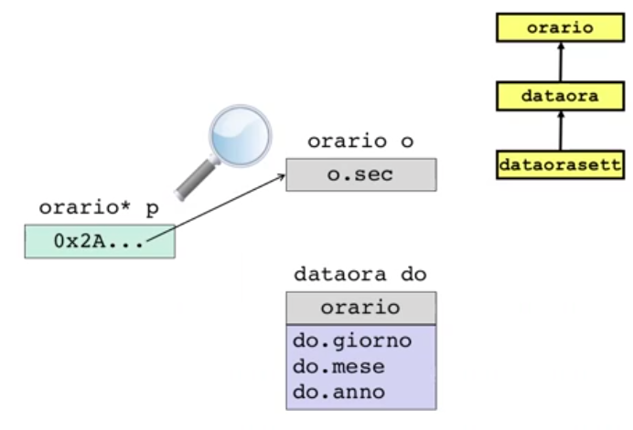
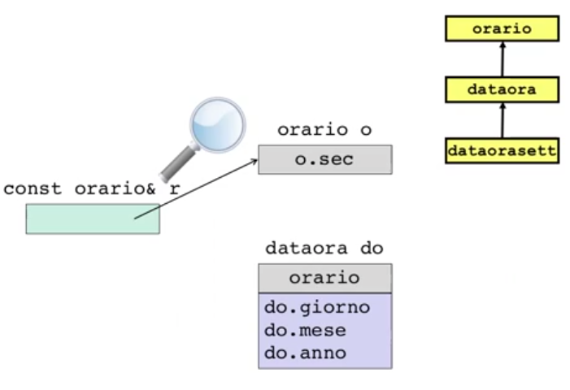
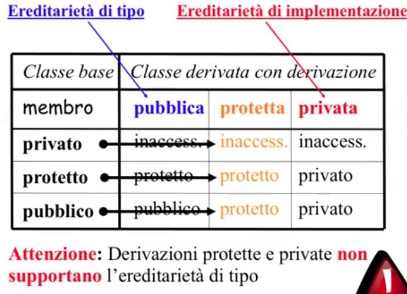

# Descrizione

L'ereditarietá prevede un tipo di relazione IS-A
Polimorfismo: le variabili possono cambiare forma mentre il programma é in esecuzione


## Teoria Inheritance

In questo caso, una DataOra é (anche) un Orario
Per un oggetto di DataOra avró "inscatolato" dentro anche un oggetto di tipo Orario

Vado quindi a definire nella classe DataOra definisce solo i suoi field e le sue funzioni, sottointendendo che tutto quello che ho ereditato da Orario é parte di DataOra 
I field di DataOra prendono il nome di campi dati propri

La classe che definiamo per ereditarietá prende il nome di classe derivata (D)
La classe da cui eredito si chiama classe base (B)
Si puó anche dire che D é sottotipo (subclass) mentre B é supertipo (superclass)

É importante sottolineare che esitono le classi e i tipi
Si potrá quindi ereditare da una classe ma senza avere una relazione di sottotipaggio

In questo caso:  
Orario -> sottooggetto  
int giorno, int mese, int anno -> campi dati propri  
L'insieme dei precedenti compone -> oggetto DataOra  

La relazione "IS-A" induce il subtyping che é la caratteristica fondamentale dell'ereditarietá:  
Ogni oggetto della classe derivata é utilizzabile anche come oggetto della classe base


Subtyping: Sottotipo D => Supertipo B
  
1. Per oggetti: D => B     estrae il sottooggetto
    1. "Butta via" la parte in piú (i campi dati propri della classe derivata D)
    2. Non c'é quindi polimorfismo

2. Per puntatori e riferimenti: D* => B*  D& => B&  
    1. Supporta il polimorfismo  
    2. Copia l'indirizzo, significa prendere un indirizzo e farlo puntare ad un oggetto   (vederlo come fosse un oggetto del supertipo) ma continua ad avere l'informazione specifica del sottotipo  
    3. Non viene "buttato via" nulla  


## Gerarchie di classi: sottotipi diretti ed indiretti


Ogni passo si chiama "passo di derivazione diretta":  
F => sottoclasse diretta di => E => sottoclasse diretta di => D => sottoclasse diretta della => Base

Quindi F é una sottoclasse di D (per transitivitá) di tipo indiretto


## Casi d'uso di ereditarietá 

1. Estensione  
    1. DataOra <: Orario

2. Specializzazione  
    1. QButton <: Qcomponent  
    2. Relazione di sottotipaggio  
    3. Il pulsante non aggiunge caratteristiche ad una componente ma é una componente specializzata  

3. Ridefinizione  
    1. Queue <: List  
    2. La coda ha un campo dati di tipo lista  
    3. Ad esempio: ridefinendo il comportamento dell'insert e permettendo l'inserimento solo in coda alla lista, eredito l'intefaccia di List e ne ridefinisco alcuni sue funzionalitá  
    4. Una coda appunto, non aggiunge altre funzioni alla lista  
    5. Specializzazione != Ridefinizione: la prima va a specializzare alcune funzioni mentre la ridefinizione ne va a cambiare il comportamento  

4. Riutilizzo di codice  
    1. Queue reuse List  
    2. NON É SUBTYPING  
    3. Coda non é sottotipo di lista: faccio un passo di ereditarietá (godo dei vantaggi di definire per ereditarietá un tipo), se in un contesto chiedo una lista non ci posso mettere una coda  


## Conversioni

Data una classe B, per ogni sottotipo D (in generale indiretto) di B valgono quindi le seguenti conversioni implicite:  

1. D => B (oggetti)

2. D& => B& (riferimenti)

3. D* => B* (puntatori)


## Tipo statico del puntatore vs Tipo dinamico

Tipo statico: si riferisce al tipo di dichiarazione di una variabile (compile time)  
Tipo dinamico: mette in evidenza che questi puntatori sono polimorfi, possono memorizzare indirizzi (oggetti, non necessariamente dello stesso tipo di quello dichiarato) (run time) é un sottotipo del tipo statico di dichiarazione di quel puntatore 

Conversione D* => B*

```cpp
D d; 
D b;
D* pd = &d;
B* pb = &b;
pb = pd;
```
Grazie all'ereditarietá quell puntatore puó essere un DataOra



Allo stesso modo, quanto detto sopra vale anche per i riferimenti

Conversione D& => B&

```cpp
D d;
B b;
D& rd = d;
B& rb = d;

// D& é il tipo dinamico di rb
```
Per subtyping quel reference puó essere un reference ad un sottotipo




## Accessibilitá della classe base

La parte privata della classe base é INACCESSIBILE alla classe derivata

```cpp
dataora::Set2K(){
    sec = 0;    // ILLEGALE!
    giorno = 1;
    mese = 1;
    anno = 2000;
}
```
Viene quindi introdotto un nuovo livello di accessibilitá: protected

Con passo di derivabilitá privata non torna il concetto di subtyping, modellando cosi il caso di "Riutilizzo del codice"  
É una sottoclasse ma non é un sottotipo



```cpp
class C{
    private:
        int priv;
    protected:
        int prot;
    public:
        int publ;
};

class D : private C{
    // prot e publ diventano privati
};

class E : protected C{
    // prot e publ diventano protetti
};

class F : public D{
    // prot e publ sono qui inaccessibili
    public:
        void fF(int i, int j){
            prot = i;   // ILLEGALE
            publ = j;   // ILLEGALE
        }
};

class G : public E{
    // prot e publ rimangono qui protetti
    void fG(int i, int j){
        prot = i;   // OK
        publ = j;   // OK
    }
};
```

### Livello protected

1. Inacessibile all'esterno -> come fosse private  

2. Acessibile per i sottotipi -> diretti e indiretti    

3. Non supporta il subtyping  

4. I membri protected rappresentano una violazione dell'information hiding


## Ereditarietá privata

Siginifica "essere implementati in termini di " != essere un sottotipo  
La classe che eredita privatamente da una base dipende come implementazione (non come design) dalla base;    
Se D deriva privatamente da B significa che in D si é interessati ad aclune funzionalitá di B e non si é interessati ad una relazione concettuale di subtyping tra D e B.  
L'ereditarietá privata eredita l'implementazione di B ma non l'interfaccia di B.   

L'ereditarietá privata non gioca alcun ruolo nella fase di progettazione del software ma solo nella fase di implementazione del software.  
