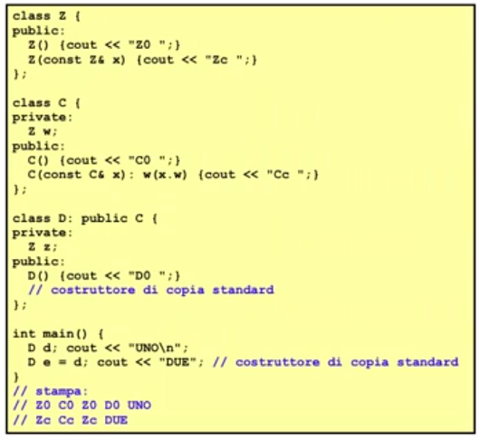

# Descrizione

Discussione su costruttori, distruttori e assegnazioni per le classi derivate nel contesto di inheritance


## Costruttori, distruttori, assegnazioni nelle classi derivate

Sempre necessari costruttori, distruttori e assegnazioni di default

Se vogliamo ridefinirle abbiamo queste regole  

### Costruttore

La lista di inizializzazione di un costruttore di una classe D derivata DIRETTAMENTE da B (D si occupa solo del padre) in generale puó contenere invocazioni di costruttori per i campi dati (propri) di D e l'invocazione di un costruttore della classe base B

L'esecuzione di un tale costruttore di D avviene nel seguente modo:

1. viene sempre e comunque invocato perprimo un costruttore della classe base B, o esplicitamente o implicitamente il costruttore di default di B quando la lista di inizializzazione non include una invocazione esplicita;
 
2. successivamente, secondo il comportamento giá noto, viene eseguito il costruttore "proprio" di D, ossia vengono costruitii campi dati propri di D;

3. infine eseguito il corpo del costruttore

Di conseguenza, se nella classe derivata D si omette qualsiasi costruttore, come al solito, é disponibile il costruttore di default standard di D  
Il suo comportamento é quindi il seguente:

1. richiama il  costruttore di default di B

2. successivamente si comporta come il costruttore di default standard "proprio" di D, ossia richiama i costruttori di default per tutti i campi dati di D

```cpp
class Z{
    public:
        Z() {cout << "Z0 ";}
        Z(double d) {cout << "Z1 ";}
};

class C{
    private:
        int x;
        Z w;
    public:
        C(): w(6.28), x(8) {cout << x << " C0 ";}
        C(int z): x(z) {cout << x << " C1 ";}
};

class D : public C{
    private:
        int y;
        Z z;
    public:
        D(): y(0) {cout << "D0 ";}
        D(int a): y(a), z(3.14), C(a) {cout << "D1 ";}
};

int main(){
    D d;
    cout << "UNO\n";
    D e(4);
    cout << "DUE";
}

// STAMPA:
// Z1 8 C0 Z0 D0 UNO
// Z0 4 C1 Z1 D1 DUE
```

### Costruttore di copia

Costruttore di copia standard della classe derivata  
Per il sottooggetto -> costruzione di copia  
Per i campi dati -> costruzione di copia  

Il costruttore di copia standard chiama il costruttore di copia anche per il sottooggetto e per i suoi campi dati

Se viene ridefinito a fini di tracciamento deve essere ridefinito analogamente al costruttore di copia standard, di seguito un esempio


