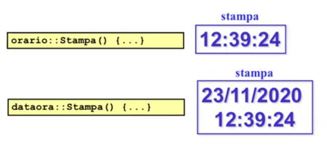
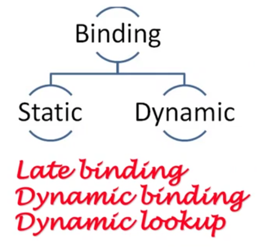
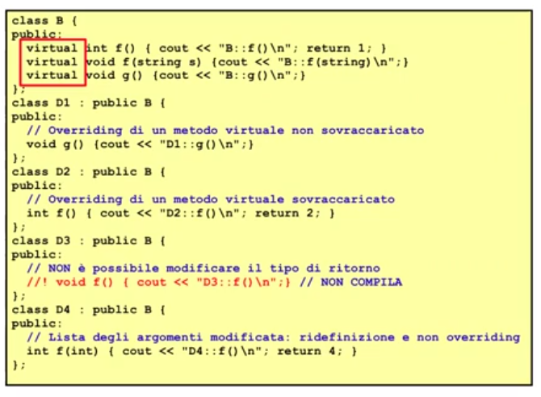
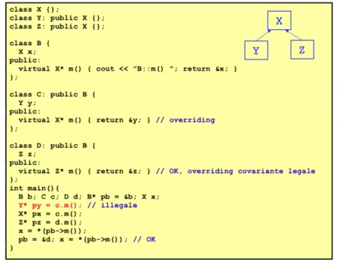

# Descrizione

Discussione riguardo il polomorfismo nelle funzioni


## Funzioni polimorfe

Abbiamo visto durante il corso il polimorfismo del parametro, ad esempio: 

```cpp 
void F(orario o);
...
dataora d;
F(d);
```
VS 

```cpp
void G(const orario& o);
...
dataora d;
G(d);
```
Per arrivare ad una funzione polimorfa abbiamo definito 



```cpp 
orario::Stampa(){...}

dataora::Stampa(){...}
```
Codice esterno:

```cpp
void printInfo(const orario& r){
    r.Stampa();
}
```

```cpp
void printInfo(const orario* p){
    p->Stampa();
}
```

Adesso voglio avere una funzione che prende un orario polimorfo (quindi passato per riferimento costante (in sola lettura))

Quello che vorrei é che l'informazione dell'oggetto di invocazione fosse guidata (non dal tipo di dichiarazione di questa variabile polimorfa ma) dal suo tipo dinamico  
Mi attendo quindi un comportamento polimorfo per questa funzione: se invoco Stampa() su un orario viene stampato un orario, se invoco Stampa() su un dataora viene stampato l'orario e la data,...  

Il tipo dinamico é imprevedibile perché la gerarchia di tipi puó essere infinita  

Il legame tra variabile di invocazione (necessariamente polimorfa) e funzione chiamata non sará determinata dal compilatore e prende il nome di dynamic binding

## Binding




1. Late binding: il binding viene fatto a runtime

2. Dynamic bynding

3. Dynamic lookup: il recupero della funzione da invocare é deciso a runtime

Static significa che lo fa il compilatore, Dynamic significa che succede a runtime


## Virtual

In c++ va dichiarato in maniera esplicita (in Java, ad esempio sono tutte virtuali)  

Quando chiamo una funzione virtuale con una variabile polimorfa la funzione che verrá invocata sará quella determinata dal tipo dinamico del mio riferimento polimorfo: se orario si riferisce ad orario sará Stampa() di orario, se orario si riferisce ad un dataora sará Stampa() di dataora

Nell'esempio:

1. orario diventa una classe polimorfa

2. Stampa() é un contratto polimorfo 


## Overloading & Overriding

1. Overloading: ridefinizione di una funzione, puó avere segnatura diversa

2. Overriding: ridefinizione di una funzione virtuale

L'overriding é permesso da tutti i linguaggi OOP, in cui la versione del metodo che sará eseguita sará determinata dall'oggetto che é usata per invocarla (oggetto a cui si riferisce il mio puntatore/riferimento polimorfo = tipo dinamico della varibile polimorfa)

Nelle funzioni virtuali con valori di default non dobbiamo ripetere i valori di default (proprio come quando definiamo la funzione fuori dalla classe e ne riportiamo la segnatura)

### Overriding di metodi virtuali

1. Identica segnatura, tipo di ritorno e const incluso

2. Se la lista degli argomenti é identica ma cambia il tipo di ritorno il compilatore segnala un errore




## Covarianza

Permette di segnalare alla classe che fa un overriding che ritorna qualcosa che é piú "ricco" essendo un sottotipo

Se si ritorna un puntatore o un riferimento in una funzione virtuale e l'overriding ritorna qualcosa di piú specializzato é regola arrichire il tipo di ritorno


