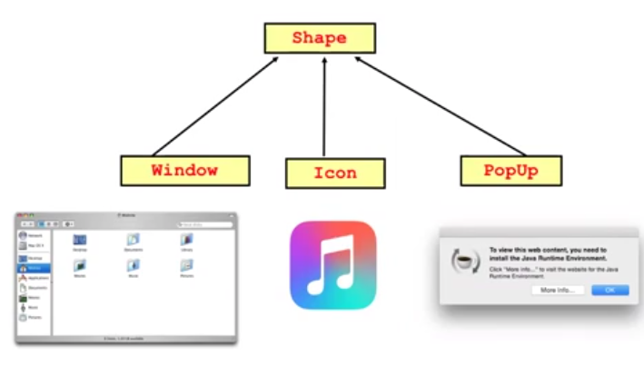
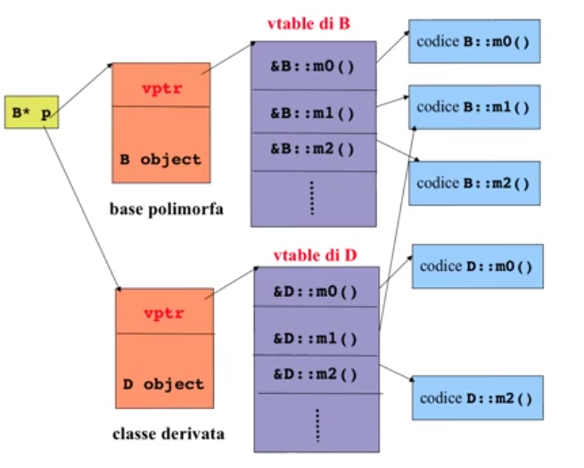

# Descrizione

Discussione riguardo l'implementazione di funzioni Virtuali


## Regola

Il buon uso del polimorfismo promuove l'estensibilitá del codice


## Esempio 

Un buon esempio é il windows manager (es. "Mission Control" in MacOS) che non fa alcuna differenza in base a che programma si riferisce tale finestra, esso dá l'ordine di dove posizionare tali finestre

Si adatta bene all'idea di incapsulare questo algoritmo mediante funzioni virtuali



Nel file Shape.cpp si trova tale esempio

## Implementazione del Late Binding

Il Late Binding ha un overhead di circa il 6-13% in piú a runtime ma puó arrivare ad un 50% nei casi peggiori (ció é dovuto alla dereferenziazione del puntatore e del salto a quell'indirizzo)

La Virtual Table (tabella dei metodi virtuali) é il meccanismo usato nei linguaggi di programmazione per supportare il dispatch dinamico (o runtime method binding)

Quando una classe definisce una funzione virtuale, la maggior parte dei compilatori aggiunge una variabile nascosta che é un puntatore che punta alla tabella dei metodi virtuali: essa contiene gli indirizzi delle funzioni virtuali della classe base  
Facendo overriding c'é l'ulteriore tabella ed un puntatore a tale tabella che prende il nome di Virtual Pointer

Per implementare il Late Binding quindi: 
1. Puntatore tipo statico/dinamico -> vado all'indirizzo dove é contenuto il puntatore alla Vtable
2. Con il puntatore alla Vtable (specifico per il suo tipo dinamico) vado nella Virtual Table
3. I metodi sono ordinati (c'é un array)
4. Quando faccio una chiamata sto cercando l'i-esima cella di quell'array
5. Vado a quella cella -> trovo l'indirizzo della funzione -> vado a quella funzione

## Virtual pointer vptr



N.B. : &D::m1() non ha overriding in D quindi punta alla versione originale della clase Base B

```cpp
class B{
    public:
        FunctionPointer* vptr;  // vpointer aggiunto dal compilatore
        virtual void m0() {}
        virtual void m1() {}
        virtual void m2() {}
};

class D: public B{
    public:
        FunctionPointer* vptr;  // vpointer aggiunto dal compilatore
        virtual void m0() {}    // override
        virtual void m2() {}    // override
};

int main(){
    B* p;

    p = &b;
    p->m2();
    // chiama la funzione all'indirizzo *((p->vptr)+2) cioé chiama B::m2()

    p = &d;
    p->m2();
    // chiama la funzione all'indirizzo *((p->vptr)+2) cioé chiama D::m2()
}
```
