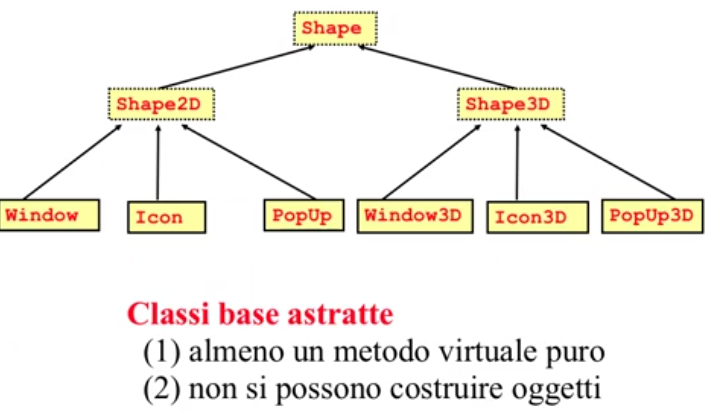
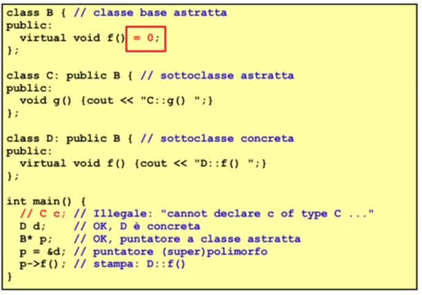
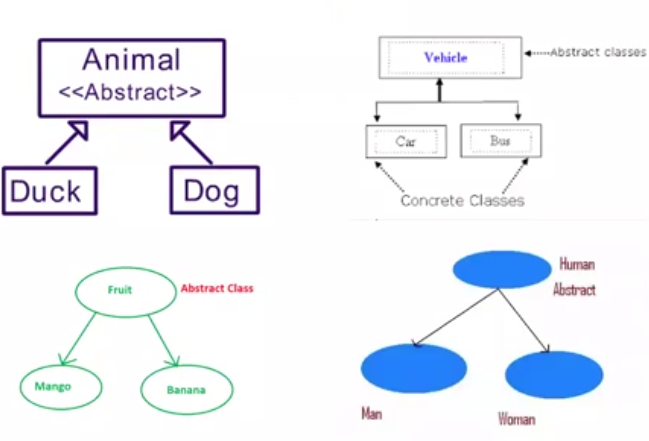
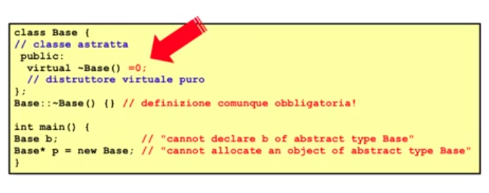

# Descrizione

Discussione riguardo le classi base astratte (risolvere il problema della superclasse in Shape )

## Classi Base Astratte

Una classe é astratta in C++ se contiene almeno un metodo virtuale puro 

Nel nostro esempio, una Shape é un tipo che possiamo definire astratto che é li per non essere istanziato (gli oggetti di Shape non esistono)

É un tipo utilissimo nel design della gerarchia di tipi ma non é un tipo concreto, esistono solo i puntatori e i riferimenti a Shape: non esisono gli oggetti di Shape

In un linguaggio che supporta l'ereditarietá un Abstract Base Class (ABC) é una classe che non puó essere istanziata perche é specifica dei metodi astratti (virtuali)  

Un metodo virtuale puro é un metodo virtuale senza implementazione

É un contratto che da le linee guida (il compito che deve essere svolto ad alto livello) e a quel livello non ci sono i dettagli sufficienti per portare a compimento quel compito: dichiara solo l'esistenza di quella funzionalitá ma non la implementa  

Una classe di soli metodi virtuali prende il nome di Classi Base Astratte Pure (Pure Abstract Base Class or Pure ABC) in C++ ed é anche conosciuta come interfaccia 

All'opposto troviamo le Concrete Class (classi concrete) che possono essere istanziate

Classi Base Astratte hanno il bordo tratteggiato

Dicharando una funzione virtuale astratta richiede:
1. Il "virtual" davanti
2. La keyword " =0 " infondo 

I costruttori devono esserci perche questi oggetti vivono come sottooggeti

## Distruttore virtuale puro

Il distruttore serve sempre, a questo punto per dire che quel tipo diventa astratto semplicemente dichiarandolo: lo strumento da utilizzare é dichiarare che il distruttore é virtuale puro

Ne devo dare comunque l'implementazione

Questo é un metodo per ottenere delle classi astratte é dichiarare un distruttore virtuale puro, ció evita l'inutile definizione di metodi virtuali puri  
Dichiarando il metodo di distuzione virtuale puro -> la classe diventa astratta -> non istanziabile -> abbiamo ottenuto un tipo astratto

Se una classe é polimorfa il distruttore DEVE essere virtuale, anche se va bene quello standard va comunque dichiarato virtual