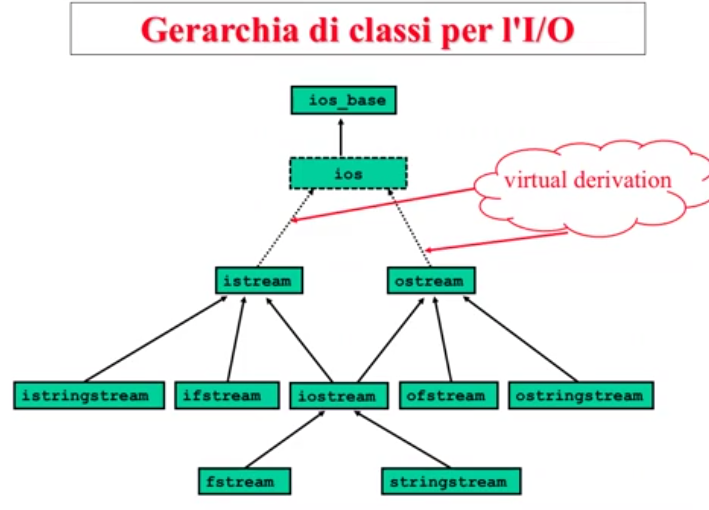
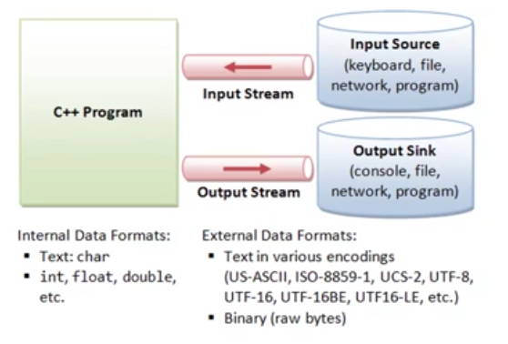
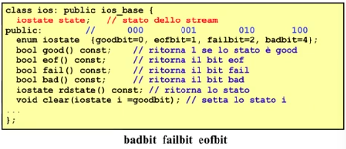
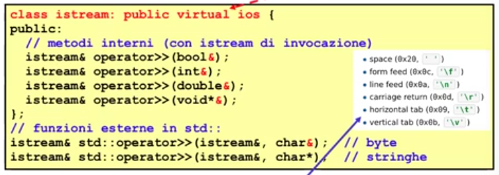

# Descrizione

Discussione riguardo la gerarchia di classi per l'I/O


## Gerarchia I/O Stream



Il concetto di base é il concetto di stream : é l'astrazione per un dispositivo di input/output  
L'unitá atomica di questo flusso di dati é il byte, questi flussi di dati sono potenzialmente infiniti in quanto unbounded e quindi lo stream é una sequenza di dati (ogni cella ha un indice, ed ogni cella contiene un byte)  
Stream : 

Per fare input avremo bisogno di una sorgente di dati che rilascia dei byte che vanno a fluire verso il programma  
L'interazione tra la sorgente di dati e il programma é uno stream che é un oggetto di tipo istream

Per fare output il programma interagisce con una destinazione di dati, i suoi dati vanno a fluire verso questa destinazione che significa avere un oggetto di output di tipo ostream

Le sorgenti e le destinazione di dati sono:



Sui dispositivi di IO i dati sono dei byte

Caratteristiche basilari degli stream:

1. La posizione delle celle di uno stream parte da 0: le sequenze di celle hanno delle posizioni, i cui indici partono da 0

2. I/O effettiva avviene tramite un buffer associato allo stream

3. Uno stream puó trovarsi nello stato di end-of-file: si applica a qualsiasi dispositivo


### Stato dello stream

Uno stream puó trovarsi in 8 stati di funzionamento diversi. Lo stato é diu tipo standard iostate (la rappresentazione non é standard, normalmente int) ed é rappresentato da un attributo di ios che chiamiamo state e corrisponde al numero binario  

bad fail eof

dove bad, fail ed eof sono dei bit (0 e 1) di stato:

1. eof == 1 <=> lo stream é in end-of-file

2. fail == 1 <=> RECUPERABILE: la precedente operazione sullo stream é fallita: si tratta di un errore senza perdita di dati, normalmente é possibile continuare. Ad esempio, si chiedeva in input un int e si trova invece un double  
es. Input da shell di un INT mi attendo una sequenza di cifre che rappresentano un valore intero, ma se mi trovo una sequenza di caratteri che rappresenta un float => si accende il bit di fail

3. bad == 1 <=> IRRECUPERABILE: la precedente operazione sullo stream é fallita con perdita dei dati: é un errore fatale/fisico, normalmente non é possibile continuare. Ad esempio, cerco di accedere ad un file o ad una network connection inesistenti


## La classe ios

ios (derivata da ios_base) é la classe base astratta "virtuale" e polimorfa (distruttore virtuale) della gerarchia che permette di controllare lo stato di funzionamento di uno stream.   Per quanto concerne lo stato di uno stream, la chiarazione della classe ios é la seguente:




## La classe istream

Gli oggetti della sottoclasse rappresentano stream di input.  
cin é un oggetto di istream che rappresenta lo standard input

istream include l'overloading dell'operatore di input operator>> per i tipi primitivi e per gli array di caratteri.



Tutti gli operatori di input ignorano le spaziature (cioé spazi, tab, enter) presenti prima del valore da prelevare.  
Quando una operazione di input fallisce (fail==1) non viene effettuato alcun prelievo dallo stream e la variabile argomento di operator>> non subisce modifiche


```cpp
```
