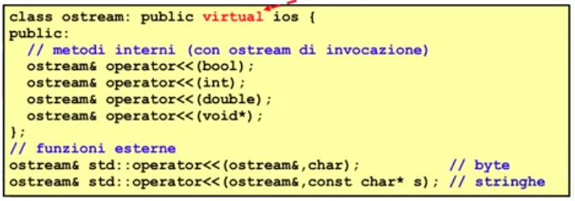
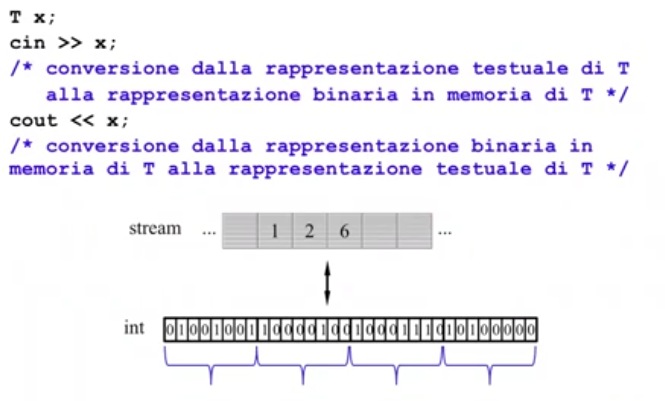
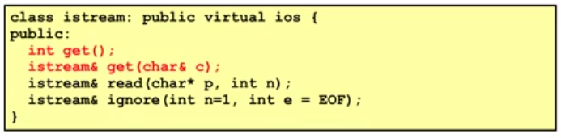
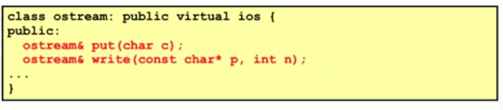
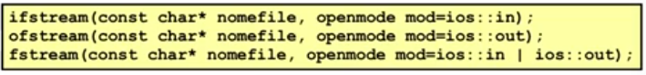
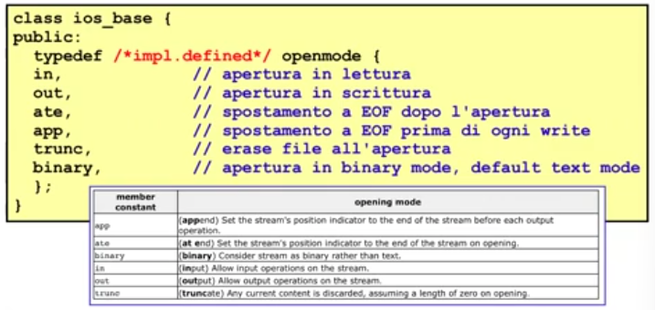

# Descrizione

Discussione riguardo la gerarchia di classi per l'I/O


## Gerarchia I/O Stream


Il concetto di base é il concetto di stream : é l'astrazione per un dispositivo di input/output  
L'unitá atomica di questo flusso di dati é il byte, questi flussi di dati sono potenzialmente infiniti in quanto unbounded e quindi lo stream é una sequenza di dati (ogni cella ha un indice, ed ogni cella contiene un byte)  
Stream : 

Per fare input avremo bisogno di una sorgente di dati che rilascia dei byte che vanno a fluire verso il programma  
L'interazione tra la sorgente di dati e il programma é uno stream che é un oggetto di tipo istream

Per fare output il programma interagisce con una destinazione di dati, i suoi dati vanno a fluire verso questa destinazione che significa avere un oggetto di output di tipo ostream

Le sorgenti e le destinazione di dati sono:


Sui dispositivi di IO i dati sono dei byte

Caratteristiche basilari degli stream:

1. La posizione delle celle di uno stream parte da 0: le sequenze di celle hanno delle posizioni, i cui indici partono da 0

2. I/O effettiva avviene tramite un buffer associato allo stream

3. Uno stream puó trovarsi nello stato di end-of-file: si applica a qualsiasi dispositivo


### Stato dello stream

Uno stream puó trovarsi in 8 stati di funzionamento diversi. Lo stato é diu tipo standard iostate (la rappresentazione non é standard, normalmente int) ed é rappresentato da un attributo di ios che chiamiamo state e corrisponde al numero binario  

bad fail eof

dove bad, fail ed eof sono dei bit (0 e 1) di stato:

1. eof == 1 <=> lo stream é in end-of-file

2. fail == 1 <=> RECUPERABILE: la precedente operazione sullo stream é fallita: si tratta di un errore senza perdita di dati, normalmente é possibile continuare. Ad esempio, si chiedeva in input un int e si trova invece un double  
es. Input da shell di un INT mi attendo una sequenza di cifre che rappresentano un valore intero, ma se mi trovo una sequenza di caratteri che rappresenta un float => si accende il bit di fail

3. bad == 1 <=> IRRECUPERABILE: la precedente operazione sullo stream é fallita con perdita dei dati: é un errore fatale/fisico, normalmente non é possibile continuare. Ad esempio, cerco di accedere ad un file o ad una network connection inesistenti


## La classe ios

ios (derivata da ios_base) é la classe base astratta "virtuale" e polimorfa (distruttore virtuale) della gerarchia che permette di controllare lo stato di funzionamento di uno stream.   Per quanto concerne lo stato di uno stream, la chiarazione della classe ios é la seguente:


## La classe istream

Gli oggetti della sottoclasse rappresentano stream di input.  
cin é un oggetto di istream che rappresenta lo standard input

istream include l'overloading dell'operatore di input operator>> per i tipi primitivi e per gli array di caratteri.


Tutti gli operatori di input ignorano le spaziature (cioé spazi, tab, enter) presenti prima del valore da prelevare.  
Quando una operazione di input fallisce (fail==1) non viene effettuato alcun prelievo dallo stream e la variabile argomento di operator>> non subisce modifiche

operator>>(double& val) preleva dallo istream di invocazione una sequenza di caratteri che rispetta la sintassi dei litterali 
double e converte tale sequenza nella rappresentazione numerica di double assegnandolo a val.  
Se la sequenza di caratteri non soddisfa la sintassi prevista per double, l'operazione é nulla e l'istream va
in uno stato di errore recuperabile: fail==1 e bad==0

Definire un overloading di operator>> per qualche classe C significa dare un significato alla conversione

sequenza di byte => oggetto di C

Cioé significa fare del parsing di una sequenza di byt di input secondo le regole di rappresentazione sintattica degli oggetti di C  

Parsing: in informatica, il parsing, analisi sintattica o parsificazione é un processo che analizza un flusso continuo di dati 
in ingresso in modo da determinare la sua struttura grazie ad una data grammatica formale. Un parser é un programma
che esegue questo compito.

Esempio di parsing:  

```cpp
class Punto{
    friend istream& operator>>(istream&, Punto&);
    // legge nel formato (x1,x2): rappresentazione testuale di Punto
    private:
        double x, y;
};

// ALGORITMO DI PARSING
istream& operator>>(istream& in, Punto& p){
    char cc;
    in >> cc;           // std::operator>>(istream&, char&)
    if(cc == 'q')       // carattere q per uscire
        return in;
    if(cc != '('){
        in.clear(ios::failbit);
        return in;
    }
    else{
        in >> p.x;          // istream::operator>>(double&)
        if(!in.good()){
            in.clear(ios::failbit);
            return in;
        }
        in >> cc;
        if(cc != ','){
            in.clear(ios::failbit);
            return in;
        }
        else{
            in >> p.y;      // istream: operator>>(double&)
            if(!in.good()){
                in.clear(ios::failbit);
                return in;
            }
            in >> cc;
            if(cc != ')'){
                in.clear(ios::failbit);
                return in;
            }
        }
    }
    return in;  // SPAZIATURE??
}
```

## La classe ostream

Gli oggetti della sottoclasse ostream rappresentano stream di output.  
cout e cerr sono oggetti di ostream (standard output ed error)

La classe ostream include l'overloading dell'operatore di output<< per i tipi primitiv eper gli array di 
caratteri costanti 



Questi operatori convertono valori di tipo primitivo in sequenze di caratteri che vengono scritti (immessi)
nelle celle dell'ostream di invocazione. Per quanto riguarda l'output di stringhe, i caratteri della stringa s
vengono scritti nell'ostream fino al carattere nullo escluso


## I/O testuale e binario

L'input/output sugli stream tramite operatori di input/output >> e << considerano gli stream nel cosiddetto formato testo



Quindi, l'informazione da leggere o scrivere su uno stream deve avere una natura testuale. Spesso ció non é vero
(almeno in modo naturale).  
In questo caso, possiamo consideare lo stream in formato binario, cioé tutti i singoli caratteri dello stream vengono
trattati allo stesso modo senza alcuna interpretazione.

L'input binario da uno istream, cioé carattere per carattere (byte per byte senza interpretazione per byte)
puó essere fatto tramite alcuni metodi di "get()" di istream.



Il metodo int get() preleva un singolo carattere (1 byte) dall'istream di invocazione e lo restituisce convertito ad
intero in [0,255]. Se si é tentato di leggere EOF ritorna -1.  
Il metodo get(car& c) invece memorizza in c il carattere prelevato, se questo esiste, e ritorna l'istream.  
Il metodo read(char* p, int n) preleva dall'istream di invocazione n caratteri, a meno che non incontri prima EOF,
e li memorizza in una stringa puntata da p.  
Il metodo ignore(int n, int e=EOF) effettua il prelievo di n caratteri ma non li memorizza.

L'output binario su uno ostream puó essere fatto tramite i seguenti metodi di "put()" di ostream



Il metodo put(char c) scrive il carattere c nello ostream di invocazione, e ritorna l'ostream.  
Il metodo write(const char* p, int n) scrive sullo ostream di invocazione i primi n caratteri della stringa puntata
da p, e ritorna l'ostream


## Gli stream di file

Gli stream associati a file sono oggetti delle classi ifstream, ofstream, e fstream. Sono disponibili diversi costruttori (vedere documentazione), i piú comuni dei quali sono:



La stringa nomefile é il nome del file associato allo stream, mentre le modalitá di apertira dello stream sono specificate da un tipo openmode nella classe ios_base



Le modalitá di apertura di uno stream su file possono essere combinate tramite l'OR bitwise.  
Per default, gli oggetti ifstream sono aperti in lettura mentre quelli di ofstream sono aperti in scrittura. Un fsream puó essere aperto sia in lettura che in scrittura.

Esempio:

Apertura file "dati.txt" in i/o
```cpp
fstream file("dati.txt", ios::in|ios::out);
if(file.fail()) 
    cout << "Errore in apertura ";
```

Apertura in modalitá binaria di append alla fine del file "dati.txt"
```cpp
ofstream file("dati.txt", ios::app|ios::nocreate|ios::binary);
if(file.bad())
    cout << "Il file non esiste ";
```

CHIUSURA DI UN FILE: Il metodo close() chiude esokuctamente un file: viene automaticamente invocato dal distruttore dello stream


## Stream di stringhe