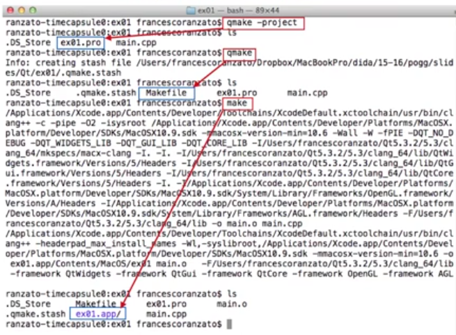
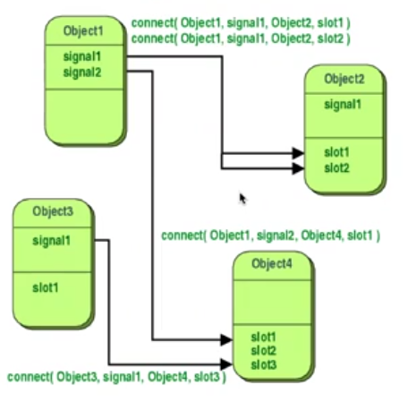
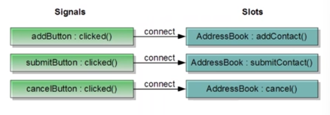
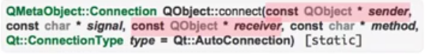
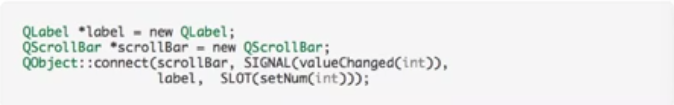
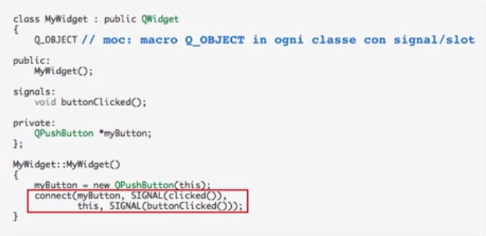

# Descrizione

Discussione riguardo il framework Qt

## Qt

Qt é utilizzato principalmente per sviluppo di applicazioni software con interfacce grafiche (GUIs).  
Il modello per progettare queste GUI si basa sul modello segnale e slot, il meccanismo per supportare la programmazione reattiva si chiama di "callback", chiamate di ritorno sugli eventi che scaturiscono dall'interfaccia grafica e poi viene implementato in vari modi (come segnali e slot).  
Si é evoluto negli anni al punto di arrivare ad essere quasi un linguaggio a se, tanto da includere un linguaggio dichiarativo di scripting che si chiama Qt Quick che permette di usare JavaScript per fornirne la logica.  
Include inoltre un supporto semplice a formati strutturati come XML e JSON, soprattuto per il parsing.  

Alcuni esempi famosi che utilizzano il framework Qt sono il client desktop di Telegram, Adobe Photoshop e Google Earth.

Le piattaforme ufficialmente supportate sono:

L'IDE é Qt Creator che viene fornito con il pacchetto Qt, allo stesso tempo é anche fornito Qt Designer che é un tool per disegnare e costruire intterfacce grafiche di Qt Components: il paradigma é "what you see is  what you get".  
Il downside di Qt Designer é che il codice viene autoprodotto, ma risulta estremamente ridondante ed inefficiente.

In Qt ogni cosa é un oggetto (paradigma C++ oop) e quindi ogni cosa é un tipo, il modello é guidato ad eventi che sono scaturiti dall'interazione dell'utente con questa interfaccia grafica:
1. Qt é comletamente ad oggetti ed event driven  
2. Qt estende C++ con segnali e slot utilizzando il Meta Object Compiler (MOC)

Varie funzionalitá nonGUI:
1. Accesso a database SQL
2. Qcontainers: tutti quelli di STL replicati dento Qt
3. Interazione con JavaScript
4. XML e JSON supportati
5. Programmazione concorrente (threads)
6. Programmazione di rete: dati prelevati da una fonte in rete

## Paradigma della programmazione Event Driven

L'esempio piú classico é la calcolatrice, con dei widget (pulsanti) che riportano delle etichette, una parte di GUI in cui attendo l'output della GUI (la reazione della GUI rispetto alle interzioni fatte tramite i suoi meccanismi di input,i pulasanti): se non viene fatto nulla la GUI non fa nulla, rimane in attesa di eventi che scaturiscono da interazioni, di tutti i tipi come movimento del mouse o arrivo di input da rete.  
L'evento é gestito dalla GUI, la reazione é codificata da una chiamata di funzione (uno slot); una volta che la funzione viene portata a termine la GUI é pronta alla gestione del prossimo evento.

## Classe madre di tutte le classi

In Qt tutte le classi ereditano da QObject, ogni tipo é sottotipo di QObject

Dentro QObject sono incapsulate le caratteristiche comuni a tutti i tipi, in particolare connect() e disconnect() cioé le funzioni che permettono di collegare segnali e slot (funzioni interagiscono con pulsanti/eventi)

Permette di definire una relazione di parent/sibilings tra componenti Qt (parentela/fratellanza, con gestione automatica della distruzione parentale): ad esempio nella calcolatrice, la pulsantiera delle cifre potrebbe essere modellata come padre, e tutti i pulsanti numerati in relazione di fratellanza;  
Con queste relazioni si possono rimuovere tutti i pulsanti numerici insieme, essendo la GUI dinamica (ad esempio viene cambiata la pagina del programma).

QWidget eredita da QOject, in Qt tutte le classi GUI ereditano da QWidget: ogni elemento visibiledi una GUI é una QWidget

É inoltre obbligatorio conoscere la documentazione redatta da Qt Assistant:
1. Le proprietá sono gli attributi di interesse per comprendere il senso di quel tipo  
2. Le funzioni pubbliche
3. Le funzioni pubbliche reimplementate in quel tipo: metodi overrided sono descritti qui
4. Gli slot
5. Le funzioni protette
6. Le funzioni reimplementate
7. Descrizione dettagliate: descrizione a parole del sensodi quel tipo

Per quanto riguarda i tipi, viene fornito chi é il supertipo diretto e chi sono i suoi sottotipi diretti (padre e figli diretti)

## Compilazione da shell

Si usa qmake -project per generare il file .pro

## Segnali e slot

Ogni oggetto puó emettere dei segnali, i segnali servono per raccordarli con delle funzioni che reagiscono all'emissione di questo segnale e queste funzioni si chiamano slot (sono disponibili per alcuni tipi)

Un segnale puó essere connesso tramite connect() a piú slot dello stesso oggetto ma anche a slot di oggetti diversi 

Ad esempio segnali che possono essere emessi da un PushButton, il segnale emesso si chiama clicked() che é conneso allo slot (funzione) addContact() dell'oggetto AddressBook (nel primo esempio)

Sono possibili diverse combinazioni:
1. Segnale 1 connesso a slot 1  
2. Segnale 1 connesso a slot 1 e slot 2   
3. Segnale 1 e Segnale 2 connessi a slot 1  
4. Segnale 1 connesso a Segnale 2: segnale rimbalzato, un widget emette un segnale e invece che andare direttamente ad essere connesso ad uno slot che reagisce a quel segnale provoca l'emissione di un altro segnale (come un domino, ad un certo punto ci dovrá essere una connessione ad un slot);  

Quando viene emesso un segnale vengono invocati tutti gli slot connessi a quel segnale, le connessioni vengono eseguite seguendo un ordine (conta quindi anche l'ordine)

### Implementazione connect()

In Qt tutto é mediato tramite puntatori

Una funzione connect() definita dentro QObject (livello massimo) ed é statica, non ha quindi un oggetto di invocazione.  
La segnatura chiede l'Object che emette il segnale (const QObject* sender) é un puntatore ad oggetti costante, il segnale emesso é una stringa (const char* signal), il receiver é anche lui un puntatore ad oggetti costante (const QObject* receiver) e lo slot che deve essere connesso al sender é un'altra stringa (const char* method)

Le due macro per ottenere le stringhe associate a segnali e slot sono SIGNAL() e SLOT(): hanno come argomento il nome del segnale con l'eventuale tipo (vuole solo la segnatura, non il parametro formale (nome variabile))

 
MyWidget é un sottotipo di QWidget;  
Voglio definire i miei segnali: dico che questo mio widget puó emettere un segnale che é buttonClicked() e va definito dentro la sezione signals: dove va definita la lista di segnali.  
Nel costruttore costruisco un QPushButton() con parametro this che dice sto costruendo un figlio QPushButton che ha come padre me stesso.  
Va poi connesso il segnale clicked() con il segnale buttonClicked()

## Slots

Gli slots sono metodi "ordinari", preceduti dalla Qt keyword slots  
slot:   
    lista dei metodi di slot (che possoo essere connessi a dei segnali definti da utente)

Una classe contenente propri slots deve includere nella parte privata la macro QObject::Q_OBJECT. Che serve al MOC

In ogni file .cpp/.h che contiene la macro Q_OBJECT, tutti gli slots saranno espansi dal MOC in un file .moc

Tutto ció é gestito automaticamente da qmake

## Signals

Un segnale é una dichiarazione di una funzione "senza corpo", a cui possono essere aggiunti dei parametri. Non ha tipo di ritorno (sempre void), nome del segnale ed eventuali parametri

Aggiungere sempre alla parte privata di una classe con segnali  propri la macro QObject::Q_OBJECT. Serve al MOC

Un segnale si dichiara (non si definisce) come un metodo ordinario preceduto dalla Qt keyword signals  
signals:  
    void valueChanged(int newValue);  

Il segnale non va implementato

Per emettere il segnale si usa la Qt keyword emit:  
emit valueChanged(12)

## Costruzione e Distruzione

Sfrutta la relazione di parentela, in entrambe i sensi:
Se rimuovo un widget, lui automaticamente viene tolto da quella gerarchia di parentela; ma se io vado a rimuovere suo padre, vengono rimossi anche suo figlio, suo nipote,...