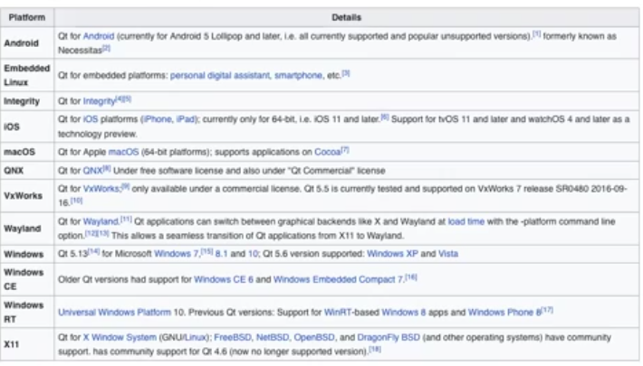
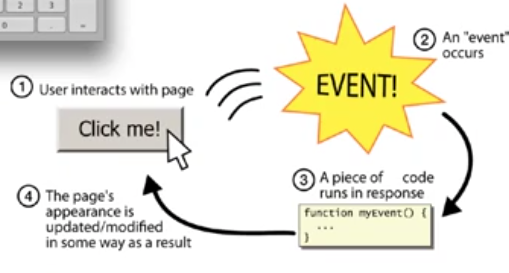
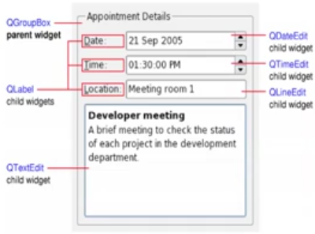
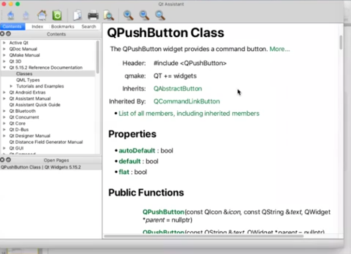

# Descrizione

Discussione riguardo il framework Qt


## Qt

Qt é utilizzato principalmente per sviluppo di applicazioni software con interfacce grafiche (GUIs).  
Il modello per progettare queste GUI si basa sul modello segnale e slot, il meccanismo per supportare la programmazione reattiva si chiama di "callback", chiamate di ritorno sugli eventi che scaturiscono dall'interfaccia grafica e poi viene implementato in vari modi (come segnali e slot).  
Si é evoluto negli anni al punto di arrivare ad essere quasi un linguaggio a se, tanto da includere un linguaggio dichiarativo di scripting che si chiama Qt Quick che permette di usare JavaScript per fornirne la logica.  
Include inoltre un supporto semplice a formati strutturati come XML e JSON, soprattuto per il parsing.  

Alcuni esempi famosi che utilizzano il framework Qt sono il client desktop di Telegram, Adobe Photoshop e Google Earth.

Le piattaforme ufficialmente supportate sono:


L'IDE é Qt Creator che viene fornito con il pacchetto Qt, allo stesso tempo é anche fornito Qt Designer che é un tool per disegnare e costruire intterfacce grafiche di Qt Components: il paradigma é "what you see is  what you get".  
Il downside di Qt Designer é che il codice viene autoprodotto, ma risulta estremamente ridondante ed inefficiente.

In Qt ogni cosa é un oggetto (paradigma C++ oop) e quindi ogni cosa é un tipo, il modello é guidato ad eventi che sono scaturiti dall'interazione dell'utente con questa interfaccia grafica:
1. Qt é comletamente ad oggetti ed event driven  
2. Qt estende C++ con segnali e slot utilizzando il Meta Object Compiler (MOC)

Varie funzionalitá nonGUI:
1. Accesso a database SQL
2. Qcontainers: tutti quelli di STL replicati dento Qt
3. Interazione con JavaScript
4. XML e JSON supportati
5. Programmazione concorrente (threads)
6. Programmazione di rete: dati prelevati da una fonte in rete

## Paradigma della programmazione Event Driven

L'esempio piú classico é la calcolatrice, con dei widget (pulsanti) che riportano delle etichette, una parte di GUI in cui attendo l'output della GUI (la reazione della GUI rispetto alle interzioni fatte tramite i suoi meccanismi di input,i pulasanti): se non viene fatto nulla la GUI non fa nulla, rimane in attesa di eventi che scaturiscono da interazioni, di tutti i tipi come movimento del mouse o arrivo di input da rete.  
L'evento é gestito dalla GUI, la reazione é codificata da una chiamata di funzione (uno slot); una volta che la funzione viene portata a termine la GUI é pronta alla gestione del prossimo evento.




## Classe madre di tutte le classi

In Qt tutte le classi ereditano da QObject, ogni tipo é sottotipo di QObject

Dentro QObject sono incapsulate le caratteristiche comuni a tutti i tipi, in particolare connect() e disconnect() cioé le funzioni che permettono di collegare segnali e slot (funzioni interagiscono con pulsanti/eventi)

Permette di definire una relazione di parent/sibilings tra componenti Qt (parentela/fratellanza, con gestione automatica della distruzione parentale): ad esempio nella calcolatrice, la pulsantiera delle cifre potrebbe essere modellata come padre, e tutti i pulsanti numerati in relazione di fratellanza;  
Con queste relazioni si possono rimuovere tutti i pulsanti numerici insieme, essendo la GUI dinamica (ad esempio viene cambiata la pagina del programma).

QWidget eredita da QOject, in Qt tutte le classi GUI ereditano da QWidget: ogni elemento visibiledi una GUI é una QWidget



É inoltre obbligatorio conoscere la documentazione redatta da Qt Assistant:
1. Le proprietá sono gli attributi di interesse per comprendere il senso di quel tipo  
2. Le funzioni pubbliche
3. Le funzioni pubbliche reimplementate in quel tipo: metodi overrided sono descritti qui
4. Gli slot
5. Le funzioni protette
6. Le funzioni reimplementate
7. Descrizione dettagliate: descrizione a parole del sensodi quel tipo

Per quanto riguarda i tipi, viene fornito chi é il supertipo diretto e chi sono i suoi sottotipi diretti (padre e figli diretti)




```cpp
telefonata bolletta::Estrai_Una(){
    if(Vuota()) throw Ecc_Vuota();
    telefonata aux = first->info;
    first = first->next;
    return aux;
}

class Ecc_Vuota{ };
```
