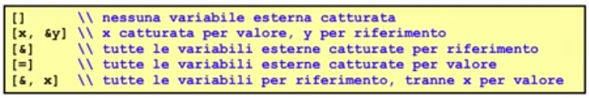
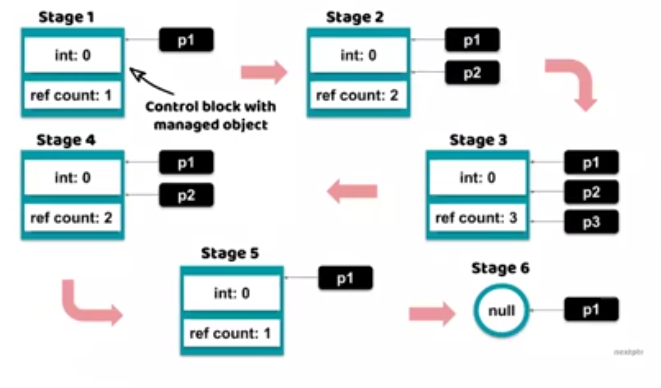
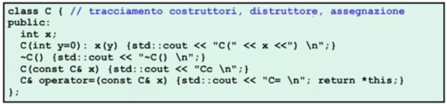
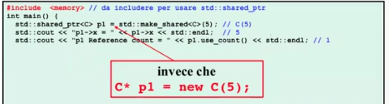
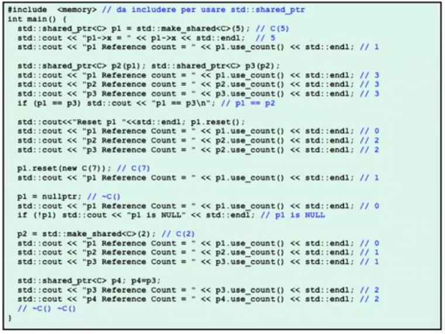

# Descrizione

Discussione riguardo il la versione 11 di C++ anche nota come C++11


## C++11

Compilazione C++11:
g++ -std=c++11

### Keyword: auto

Dichiarazioni di variabili senza specifica del loro tipo
```cpp
auto x = 0;     // x ha tipo int perché 0 é un litterale di tipo int
auto c = 'f';   // char
auto d = 0.7;   // double
auto debito_nazionale = 26000000000000L;    // long int
auto y = qt_obj.qt_fun();   // y ha il tipo di ritorno qt_fun
```

Permette di evitare alcune verbositá dello strong typing, specialmente per i template
```cpp
void fun(const vector<int> &vi){
    vector<int>::const_iterator ci=vi.begin();
    ...
}

// posso rimpiazzarlo con
void fun(const vector<int> &vi){
    auto ci=vi.begin();
    ...
}
```

### Keyword: decltype

Determina staticamente il tipo di espressioni
```cpp
int x = 3
decltype(x) y = 4;
```
```cpp
std::vector<int>
auto a = v[0];          // a ha tipo int
decltype(v[1]) b = 1;   // b ha tipo int
auto c = 0;     // c ha tipo int
auto d = c;     // d ha tipo int
decltype(c) e;  // e ha tipo int
decltype(0) f;  // f ha tipo int
```

### Inizializzazione uniforme aggregata con { }

Inizializzazione uniforme per array
```cpp
// inizializzazione di array dinamico
int* a = new int[3]{1,2,0};

class X{
        int a[4];
    public:
        X(): a{1,2,3,4} {} // inizializzazione di campo dati array
};
```

Inizializzazione uniforme per contenitori STL
```cpp
std::vector<string> vs = {"first", "second", "third"};

std::map<string,string> singers = 
    { { "Federer", "3470123456"}, {"RogerWaters", "3489876543"} };

void fun(std::list<double> l;
fun({0.34, -3.2, 5, 4.0});
```

### Keywords: default e delete

Per ogni classe sono disponibili le versioni standard di:
1. Costruttore di default  
2. Costruttore di copia  
3. Assegnazione  
4. Distruttore  

In C++11 tali funzioni standard si possono rendere esplicitamente di default oppure non disponibili
```cpp
class A{
    public:
        A(int) {}               // costruttore ad 1 argomento 
        A() = default;          // costruttore altrimenti non disponibile
        virtual ~A() = default; // distruttore virtuale standard
}
```

Viene segnalato un errore in compilazione se viene invocato un metodo segnato come delete su un oggetto di quella classe, impedendone cosi la copia e l'assegnazione in questo caso

```cpp
class NoCopy{
    public:
        NoCopy& operator=(const NoCopy&) = delete;
        NoCopy (const NoCopy&) = delete;
};

int main() {
    NoCopy a, b;
    NoCopy b(a);    // errore in compilazione
    b = a;          // errore in compilazione
}
```
Supponiamo di avere una funzione che chiede un qualsiasi tipo, e voglio disabilitarne le conversioni (ad esempio nelle catch delle exception), posso bloccarle  
La segnatura dice: per ogni tipo T diverso da quello dichiarato (in questo caso double) => delete  
A questo punto se gli passo un int o un float, viene bloccata la conversione

```cpp
class OnlyDouble{
    public:
        static void f(double){}
        template <class T> static void f(T) = delete;
        // NESSUNA CONVERSIONE A DOUBLE PERMESSA
};

int main() {
    int a = 5; float f= 3.1;
    OnlyDouble::f(a);   // ILLEGALE: use of deleted function with T = int
    OnlyDouble::f(x);   // ILLEGALE: use of deleted function with T = float
}
```

### Keyword: override (overriding esplicito)

Per dichiarare esplicitamente quando si definisce un overriding di un metodo virtuale

```cpp
class B{
    public:
        virtual void m(double){}
        virtual void f(int){}
};

class D: public B{
    public:
        virtual void m(int) override{}  // ILLEGALE 
        virtual void f(int) override{}  // OK  
};
```
Serve per evitare di definire, o dimenticare, inavvertitamente degli overriding


### Keyword: final

Un metodo virtuale final proibisce alle classi derivate di effettuare overriding, permette di imporre un ovveride finale quindi da lí in poi non ci sará piú late binding ma solo binding statico all'ultimo ovverride 

```cpp
class B{
    public:
        virtual void m(int){}
};

class C: public B{
    public:
        virtual void m(int) final {}    // final overrider
};

class D: public C{
    public:
        virtual void m(int) {}  // ILLEGALE
};
```
final puó permettere al compilatore una ottimizzazione di de-virtualizzazione


### Keyword: nullptr (puntatori nulli)

Quando si utilizza 0 con i puntatori nulli prima di c++11 in realtá si sta utilizzando una conversione da un literale di tipo int a literale di tipo void*

```cpp
void f(int);
void f(char*);

int main(){
    f(0);   // quale f invoca?
}
```
keyword: nullptr  
Sostituisce la macro NULL ed il valore 0

nullptr ha come tipo std::nullptr_t che é convertibile implicitamente a qualsiasi tipo puntatore ed a bool, mentre non é convertibile implicitamente ai tipi primitivi integrali

```cpp
void f(int);
void f(char*);

int main(){
    f(nullptr);   // quale f invoca? invoca f(char*)
}
```

```cpp
const char* pc= str.c_str();
if(pc != nullptr)
    std::cout<< pc << std::endl;
```

### Chiamate di costruttori

Un costruttore nella sua lista di inizializzazione puó invocareun altro costruttore della stessa classe, un meccanismo noto come delegation e disponibile in linguaggi come Java

Se ho un costruttore a 2 argomenti che ha i valori di default, si puó mettere nella lista di inizilizzazione delle chiamate a qualunque costruttore dello stesso tipo, specificando quindi i parametri passati

```cpp
class C{
        int x, y;
        char* p;
    public:
        C(int v, int w): x(v), y(w), p(new char [5]){}
        C(): C(0,0) {}
        C(int v): C(v,0) {}
}
```

É una alternativa al meccanismo degli argomenti di default dei costruttori; alternativa considerata preferibile da alcuni esperti di programmazione


### Funtori 

Un funtore é un oggetto di un certo tipo che rappresenta una funzione, le cui caratteristiche fondamentali sono che deve essere invocata, ha dei parametri attuali e che ha un tipo di ritorno.  
Per incapsulare quanto detto prima in modo che i suoi oggetti simulino una funzione si usa l'overloading dell'operatore "chiamata di funzione" dando cosi la possibilitá agli oggetti di un tipo di simulare "l'essere una funzione".  

```cpp
FuntorClass fun;
fun(1,4,5);

class FunctorClass{
    private:
        int x;
    public:
        FunctorClass(int n): x(n){}
        int operator() (int y) const{
            return x + y;
        }
};

int main(){
    FunctorClass sommaCinque(5);
    cout << sommaCinque(6);      // stampa 11
}
```


### Lambda espressioni o closures

Anche note come funtori anonimi o chiusure

#### Funzione anonima locale
[caputre list] (lista parametri) -> return-type {corpo}

(lista parametri) e ->return-type sono opzionali


#### Closures
[capture list] elenca la lista delle variabili della closure, cioé variabili all'esterno della Lambda
espressione usate come l-valore (lettura e scrittura) o r-valore (sola lettura) dalla lambda espressione.




### Puntatori Smart (std::shared_ptr)



L'idea di base é avere dei puntatori smart che riescono a contare il numero di puntatori ordinari
che si riferiscono a qualche oggetto  
"Riescono a contare" significa che implementano la tecnica del reference counting, l'invariante che mantengono
questi oggetti puntatori condivisi é che in ogni istante hanno un campo dati intero >0 che conta il numero
di puntatori condivisi che si riferiscono allo stesso oggetto (primitivo o definito da utente)
shared pointer é quindi un template  
Quando il contatore dei riferimenti diventa 0, l'oggetto puó essere distrutto automaticamente dal puntatore condiviso.

Per utilizzare questi shared_ptr bisogna includere <memory>



Per inizalizzarlo bisogna utilizzare la funzione make_shared in std istanziata al <tipo del puntatore>
e gioca il ruolo del costruttore 



Ho costruito un puntatore smart a C che punta ad un nuovo oggetto C (allocati sullo heap) con il costruttore
C(5)

Il count puó essere controllato con la funzione use_count() che mi da esattamente il valore reference counting
per quel puntatore smart

La funzione di reset() significa che toglie il puntatore smart che si riferisce a quell'oggetto, quindi non punta 
piú da nessuna parte 
La funzione reset() con parametri si puó spostare da un altra parte es: p1.reset(new C(7))

Se assegno allo shared pointer nullptr invoco il distruttore 



Riassumento posso utilizzare i puntatori smart come fossero puntatori ordinari con la differenza che quando si
crea garbage viene automaticamente deallocato
