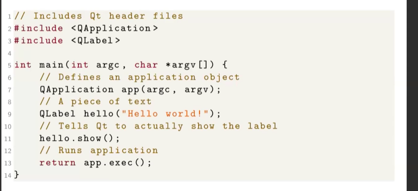

# Descrizione

Discussione riguardo il framework Qt nell'ambito del progetto didattico.

## RECAP

## Qt

### Come eseguire una applicazione 

## Primo codice in Qt

## .pro e Makefile

## Esempio di strutture layout per un applicazione GUI

## Esempio di core model logico dell'applicazione

## Separazione tra modello logico e GUI

## Esempio di implementazione InfoPanel

## Struttura di un widget

## Il metodo show()

